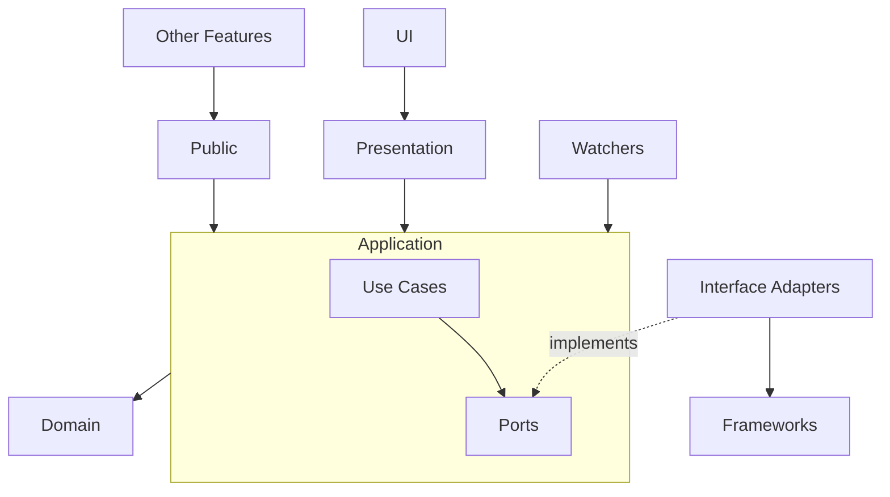

# 🏗 Architecture

This project follows a **feature-based** and **layered architecture** to ensure **separation of concerns**, **scalability** and **maintainability**.

## 📦 Feature-Based Architecture

Features are self-contained modules that encapsulate all code related to a specific functionality, domain, or resource of the application.

A feature is the single owner of its domain, meaning it is solely responsible for enforcing all business rules and domain logic related to that domain. No other feature may directly access or modify a feature’s internal domain models, state, or persistence details.

When other features need to interact with a domain, the feature should expose a well-defined public API (facade) that serves as the only entry point for cross-feature interaction. This facade defines the feature’s stable contract and ensures that business rules cannot be bypassed. And as long as the facade remains unchanged, the feature’s internal implementation can evolve freely without impacting dependent features.

This approach enables clear ownership, strong encapsulation, and independent development and testing of features. It also helps in maintaining a well-defined, acyclic dependency graph between features, preventing circular dependencies as visualized in the [Features Dependency Diagram](FEATURES.md).

## 🎯 Layered Architecture

The layers that can be encountered in the architecture are highly inspired by [**Clean Architecture**](https://blog.cleancoder.com/uncle-bob/2012/08/13/the-clean-architecture.html) and [**Hexagonal Architecture (Ports and Adapters)**](https://alistair.cockburn.us/hexagonal-architecture) principles.
They overlap and complement each other well, as Clean Architecture focuses on separation of concerns and dependency rules between layers, while Hexagonal Architecture emphasizes isolating the application’s business logic from external systems through well-defined ports and adapters.

We use the `Entities` and `Use Cases` concepts from Clean Architecture which together form the `Application` boundary in Hexagonal Architecture. They represent the pure business logic of the application and include domain models, business rules, and the orchestration of operations to achieve specific business goals.

From Hexagonal Architecture we use the concept of `Ports` (interfaces defined by the Application) and `Adapters` (concrete implementations) to isolate the Application from external systems such as databases, APIs, or UI frameworks.

More specifically, we consider `BLoC/Cubits`, feature `Facades`, and event watchers to be **Primary (Driving) Adapters**, as they drive the application by invoking `Use Cases` through inbound `Ports`.

Persistence implementations (e.g. repository or store implementations), external API clients, or other concrete infrastructure concerns are considered **Secondary (Driven) Adapters**, as they are invoked by the `Application` through outbound ports to perform operations on external systems (e.g. databases or APIs) or with concrete implementations (either with or without external dependencies). `Ports` define the needs of the `Application`, while Adapters fulfill those needs. What and how are thus clearly separated and the how is easily replaceable without affecting the business logic.

A simple example with one persistence outbound port looks like this:

               UI Adapter (Controller / BLoC)
                     |
             Inbound Port (Use Case)
                     |
               the Application
                     |
            Outbound Port (Repository)
                     |
         DB Adapter (Drift / SQL implementation)
                     |
                  Database

The adapters in Hexagonal Architecture map to the `Interface Adapters` and `Frameworks & Drivers` layers in Clean Architecture.

## 🗂️ Concrete Structure

Now how does all of the above concepts map to the actual structure and terminology used in this codebase?

Each feature folder (e.g. `/secrets`, `/labels`, `/settings`, `/wallets`) represents a self-contained feature module with the following structure:

- `domain/` contains domain models & business rules (Entities, Value Objects).
- `application/` contains use cases, ports and optionally services for code repeated in different use cases (orchestration, workflows).

> [!INFO]
> Together, `domain/ + application/` form what many texts call the "inside" of Clean/Hex
> (i.e., the business logic isolated from frameworks).

- `interface_adapters/` contains secondary/driven adapters (e.g., repository implementations).
- `frameworks/` contains external dependencies and infrastructure code (e.g., datasources, API clients, drivers) generally used by the secondary adapters if it makes sense to keep them separate for better organization, reusability or further abstraction if needed.
- `presentation/` contains the primary (driving) UI adapters namely BLoCs/Cubits and View Models if any.
- `ui/` contains UI widgets and screens that compose the visual parts of the feature. They depend on the BLoCs/Cubits from the `presentation/` layer to get their state and invoke actions.
- `public/` contains the Facade/API of the feature for cross-feature interaction.
- `watchers/` optionally contains event watchers or listeners that listen to events or data streams from external systems and invoke use cases accordingly.

Something to note is that all secondary adapters are grouped together in the `interface_adapters/` folder, while the primary adapters have their own dedicated folder, like `presentation/`, `public/` and `watchers/`. This is mostly just for clarity, organization and ease of navigation.

In the end, these folders can be mapped to the layers of Clean/Hexagonal Architecture and their interactions can be visualized like this:

As can be seen, the `Dependency Rule` and `Ports and Adapters` concepts are followed strictly.

### Special Note on Core Module

`/lib/core` is a shared technical module of low level primitives/drivers/helpers, not the “core” business logic. Core should be completely independent of any business/feature specific logic.

### Error handling

Each layer and feature should handle errors appropriately according to its responsibility. It should define its own error types and only propagate its own errors to other layers or features that depend on it. This also means every layer should make sure it catches and maps all errors from other layers it depends on to its own error types before propagating them further.

A simple convention to follow is to just create an error file per layer:

- `domain/` → `<feature_name>_domain_error.dart`
- `application/` → `<feature_name>_application_errors.dart`
- `presentation/` → `<feature_name>_presentation_errors.dart`

You can add a sealed class with different error types or exceptions as needed. As well as mappers from errors from the used layers to the layer's error types. This way each layer has its own clearly defined error types and can handle errors appropriately without leaking implementation details or error types from other layers.

## 🔺 Common Architectural Pitfalls

While the architecture described above represents our current standards, the codebase contains legacy code that predates these principles. We're actively refactoring to align with these standards. When working in the codebase, watch out for—and avoid replicating—these common anti-patterns:

**Breaking Feature Boundaries**

- **Problem**: Features directly import usecases, domain models, repositories, or services from other features
- **Impact**: Creates tight coupling, bypasses business rules, and leads to circular dependencies
- **Solution**: Always define and use a public facade for cross-feature communication

**Business Logic in Presentation Layer**

- **Problem**: BLoCs/Cubits contain orchestration logic, decision-making, or complex transformations that belong in use cases
- **Impact**: Makes business logic untestable in isolation, duplicates logic across features, and indicates poorly defined or too coarse-grained use cases
- **Root Cause**: Often happens when directly using other features' use cases instead of creating feature-specific orchestration
- **Solution**: Keep BLoCs thin—they should only transform between UI state and use case calls

**Bypassing the Application Layer**

- **Problem**: Watchers or other primary adapters directly invoke repositories, creating flows like `watcher ↔ repository ↔ datasource`
- **Impact**: Mixes primary and secondary adapter responsibilities, bypassing business rules
- **Example**: Payjoin and swap datasources managing event streams with watchers listening directly
- **Solution**: Watchers should invoke use cases, which then use repositories: `watcher → use case → repository`

**Core Module Bloat**

- **Problem**: Feature-specific business logic placed in `/core`
- **Impact**: Creates implicit coupling and makes core non-reusable across projects
- **Solution**: Keep core limited to generic primitives, low level drivers, and infrastructure helpers with no business logic

**Anemic Domain Models**

- **Problem**: Entities defined as simple data containers (DTOs) that mirror database schemas without encapsulating business rules
- **Impact**: Business logic scatters into services/use cases instead of living in the domain where it belongs
- **Solution**: Entities should encapsulate business rules and be independent of persistence concerns

**Over-Abstraction in Adapters**

- **Problem**: Unnecessary layers (e.g., both repository AND datasource for simple CRUD operations)
- **Impact**: Adds complexity and indirection without meaningful benefit
- **Solution**: Use a single repository if there's no meaningful transformation or clear logic to separate

**State Management Confusion**

- **Problem**: Mixing ephemeral widget state with BLoC state
- **Impact**: Makes state management unpredictable and harder to test
- **Solution**: Use local widget state (StatefulWidget) for UI-only concerns; use BLoC only for business state

### 🤖 Rules for AI:

- Always follow the architecture of the project when developing features.
- Always use colors from the theme; never use raw colors. When the user explains something using raw color language; find the closest color in the theme and based on the application use a color from the theme that would make sense in dark mode too but do not try to change the color theme file by yourself ever.
- When the user asks for code that breaks the architecture rules, explain why it is not a good idea and suggest an alternative that follows the architecture.
- Always write unit tests for at least the use cases and entities if they contain business rules.
