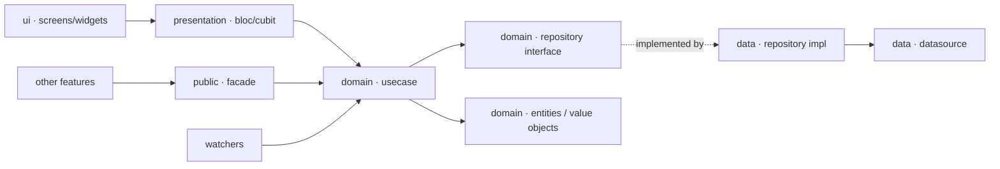

# 🏗 Architecture

This project follows a **feature-based** and **layered architecture** to ensure **separation of concerns**, **scalability** and **maintainability**.

## 📦 Feature-Based Architecture

Features are self-contained modules that encapsulate all code related to a specific functionality, domain, or resource of the application.

A feature is the single owner of its domain, meaning it is solely responsible for enforcing all business rules and domain logic related to that domain. No other feature may directly access or modify a feature’s internal domain models, state, or persistence details.

When other features need to interact with a domain, the feature should expose a well-defined public API (facade) that serves as the only entry point for cross-feature interaction. This facade defines the feature’s stable contract and ensures that business rules cannot be bypassed. And as long as the facade remains unchanged, the feature’s internal implementation can evolve freely without impacting dependent features.

This approach enables clear ownership, strong encapsulation, and independent development and testing of features. It also helps in maintaining a well-defined, acyclic dependency graph between features, preventing circular dependencies as visualized in the [Features Dependency Diagram](FEATURES.md).

## 🧭 How the codebase actually looks today

> Honest snapshot (directory census, 2026-06). Read this before assuming the sections below describe what already exists — they describe where we are heading. Numbers are approximate (`≈`) and will drift.

The codebase has **two coexisting patterns**, which is expected mid-migration:

**1. The dominant pattern — `ui → bloc → usecase → repository → datasource`** (calls flow down; data flows back up). Most shared *data + domain* lives in `lib/core/<domain>/` (≈30 domains, ≈20 datasources, ≈26 repositories, ≈167 use-case files app-wide — most in `lib/core`, ≈21 features carry their own — ~80% under `domain/usecases/`). Most *features* in `lib/features/<feature>/` are **presentation + ui** (bloc/cubit in ≈44 of 48 features) that consume `lib/core`. The shape: a datasource per external system, an abstract repository with its implementation, use-cases, a bloc on top, `get_it` for wiring. It is simple, uniform, and well understood — **this is the pattern we consolidate on.**

**2. A minority drifted to a heavier hexagonal split (≈6 modules: `labels`, `electrum_settings`, `fund_exchange`, `recipients`, `transactions`, `broadcast_signed_tx`).** Extra rings — `application/` (use-cases + ports), `adapters/`, `frameworks/`, `interface_adapters/` — plus per-layer error types and several model+mapper hops. More files, more vocabulary, no extra capability. **We converge these back** onto pattern 1 (see "Convergence" below).

**Two things barely exist yet:** the `public/` facade (≈1 feature) and `watchers/` (≈1 feature). So "facade-only cross-feature" is currently aspiration, not reality — features still reach into each other directly in places, which we are fixing.

This split maps almost 1:1 onto the melos target (see Monorepo Migration): `lib/core/<domain>` → `packages/<domain>` (shared data + domain, no UI), `lib/features/<feature>` → `features/<feature>` (presentation + ui). The migration is mostly a **relocation**, not a rewrite.

## 🎯 The architecture we tend toward

One pattern, everywhere: **`ui → bloc → usecase → repository → datasource`.** The vocabulary stays the one the team already uses — `datasource`, `repository`, `usecase`, `bloc` — with **no `port` / `adapter` / `application` / `framework` renaming**.

This is the same spine Google's official [Flutter app-architecture guide](https://docs.flutter.dev/app-architecture) *strongly recommends*: a repository-based **data layer** and an MVVM **UI layer** ([recommendations](https://docs.flutter.dev/app-architecture/recommendations)). Our **bloc/cubit plays the ViewModel role** — this mapping is ours; the official docs are state-management-agnostic and never name BLoC. We also adopt its other *strongly recommend* items: **abstract repository classes**, **immutable models**, **unidirectional data flow**, **dependency injection**, **no logic in widgets**, and **fakes for testing**.

### The rule that matters most: where does logic live?

"Too much logic in use-cases" is the symptom of logic sitting in the wrong layer. There are **three homes**, and the fix is to put each kind where it belongs — not to push everything into repositories (that just makes god-repositories):

| Home | What lives here | Litmus test |
|---|---|---|
| **Domain** (entities, value objects) | invariants **intrinsic** to one type, always true | "True regardless of the use-case?" → `Amount` ≥ 0, address format, xpub validity |
| **Repository** | **data** logic for one type: combine datasources, cache, map model↔entity, single source of truth | "Depends on *how we store/fetch* this type?" → "fetch UTXOs by merging Electrum + local DB and map to `Utxo`" |
| **Use-case** | **orchestration**: coordinate multiple repositories, multi-step workflow, flow decisions | "Coordinates several repositories / describes one user goal?" → coin-selection + build PSBT + sign + broadcast |

So: **rich domain models**, **repositories that own data-shaping**, and **thin use-cases that only orchestrate**. A 100-line use-case coordinating several repositories with rollback is fine — that *is* orchestration. A use-case that maps one model to another, or re-checks an invariant the entity already guarantees, is misplaced logic — push it down. This three-way split is the single biggest improvement we are making.

### Use-cases: always present, kept thin

Every call from the UI goes `bloc → usecase → repository`. **A bloc never imports a repository or a datasource directly** — the use-case is the stable, testable seam between presentation and data, and the place where data-layer errors are mapped to feature errors. This uniformity is deliberate: one shape to learn, one shape to review, across all 48 features.

Keeping the use-case *thin* (per the table above) is what prevents the "use-cases are overhead" trap Google warns about — the overhead is logic with no home, not the seam itself. Google rates a dedicated domain/use-case layer *Conditional* ("in most apps they add unnecessary overhead", [recommendations](https://docs.flutter.dev/app-architecture/recommendations)); we knowingly accept that small, uniform cost in exchange for one predictable pattern, and we pay it back by keeping use-cases thin.

### Repositories: abstract interface in `domain/`, implementation in `data/`

The repository is the data **seam** and the single source of truth for one data type ([data-layer](https://docs.flutter.dev/app-architecture/case-study/data-layer)). Declare it as an **`abstract interface class`** so the compiler enforces the contract and implementations can be swapped (regtest / mock / production).

- **Interface (the contract):** `domain/repositories/<noun>_repository.dart` — the single `repositories/` folder. It imports only domain types, so `domain` never depends on `data`. This is the Dependency Inversion Principle: the contract belongs with its consumer, the use-case.
- **Implementation:** `data/<noun>_repository_impl.dart`, next to the datasources it wraps. There is **no second folder named `repositories`**.

> **Source / trade-off.** Google's case study puts the abstract class *and* its implementations together in `data/repositories/<entity>/` and keeps `domain/` for models only — `BookingRepository` + `BookingRepositoryRemote` + `BookingRepositoryLocal` all in `data/` ([data-layer](https://docs.flutter.dev/app-architecture/case-study/data-layer), folder tree in the [case study](https://docs.flutter.dev/app-architecture/case-study)). We deviate on purpose: because we keep a real use-case layer in `domain/`, the interface lives in `domain/` so the dependency rule holds. It is the same Ports-&-Adapters idea — interface = port, impl = adapter — expressed in our vocabulary and without a duplicate `repositories/` folder.

### Datasources: one external system each, private to the repository

A `datasource` wraps exactly one external system (Drift, BDK, an Electrum socket, an HTTP API), is stateless, and is a **private member of its repository** — bloc and UI can never reach it directly ([data-layer](https://docs.flutter.dev/app-architecture/case-study/data-layer): *"the service is a private member, so that the UI layer can't bypass the repository"*).

### Models: at most two per entity

A **wire/persistence model** and a **domain entity**, and only when the stored/wire shape genuinely diverges from the domain. Google rates separate models *Conditional* — "adds verbosity… Use in large apps" ([recommendations](https://docs.flutter.dev/app-architecture/recommendations)). The five-types-per-record shape (entity / value-object / primitive / request-DTO / response-DTO + a mapper between each) is verbosity to collapse. Value objects are for correctness-critical primitives — amount/sats, address, fee rate — not every field.

### Error handling

- **One sealed error family per feature** by default (`<feature>_error.dart`). Most features are not deep enough to justify an error file per layer. Map foreign errors at every boundary; never leak another layer's or feature's error type.
- **Prefer a `Result` at the repository boundary** for expected, recoverable failures; `throw` for programmer errors. Dart exceptions are unchecked — callers aren't forced to handle them ([dart.dev](https://dart.dev/language/error-handling)) — so a `Result` makes failure explicit in the signature. Google offers `Result` but explicitly as *"a recommendation, but not a requirement"* ([data-layer](https://docs.flutter.dev/app-architecture/case-study/data-layer)). Adopt where it pays; don't mass-migrate existing exception code.

### Convergence (the ≈6 hexagonal modules)

Map the heavier vocabulary back onto the consolidated one — opportunistically, never a big-bang, never in an unrelated PR:

| Hexagonal (today) | Consolidated (target) |
|---|---|
| `application/usecases/` | `domain/usecases/` |
| `application/` ports | `domain/repositories/` (or `domain/` for non-repo ports) |
| `adapters/` (repo impls) | `data/<noun>_repository_impl.dart` |
| `frameworks/` (datasources, drivers) | `data/datasources/` |
| `interface_adapters/` | `presentation/` + `ui/` |

What is deprecated is the hexagonal **folders** above, not the word "port". A non-repository domain interface — an abstraction over a capability, e.g. `BlockchainPort` — keeps the `Port` suffix and lives in `domain/`. The repository's own interface is the canonical port (the Ports-&-Adapters analogy in "Repositories" above); we just name it `<Noun>Repository`, not `<Noun>Port`.

## 🗂️ Layer glossary (our terms)

- `domain/entities/` — entities and value objects; **rich** models that enforce their own invariants, never anemic DB mirrors.
- `domain/repositories/` — the **abstract** repository interfaces (the contracts use-cases depend on).
- `domain/usecases/` — one per user intent; **thin orchestration** only.
- `domain/<feature>_error.dart` — the feature's sealed error family.
- `data/datasources/` — stateless wrappers around one external system each; private to their repository.
- `data/<noun>_repository_impl.dart` — the concrete repository implementation.
- `data/models/` — wire/persistence models (at most one extra model beyond the entity, and only if the stored shape diverges); `data/mappers/` optional.
- `presentation/` — bloc/cubit + state + event. The ViewModel: holds UI state, exposes intents, calls use-cases. Thin — no business decisions.
- `ui/` — screens + widgets; depend on the bloc only.
- `public/` — the feature's facade: the only entry point other features may import.
- `watchers/` — optional event listeners that drive use-cases (never repositories directly).

## 🧩 Feature & package templates

**Canonical feature (self-contained, owns its data):**

```
<feature>/
  domain/
    entities/         # (+ value objects) — rich models
    repositories/     # abstract interfaces (the contracts)
    usecases/         # one per intent, thin orchestration
    <feature>_error.dart
  data/
    datasources/      # one external system each, private to the repo
    models/           # one extra model beyond the entity, only if it diverges
    <noun>_repository_impl.dart
  presentation/       # <feature>_bloc.dart + state + event
  ui/
    screens/
    widgets/
  public/             # <feature>_facade.dart — only if consumed cross-feature
  <feature>_locator.dart
```

The canonical flow, end to end:


```mermaid
graph LR
    UI[ui · screens/widgets] --> P[presentation · bloc/cubit]
    OF[other features] --> F[public · facade]
    P --> UC[domain · usecase]
    F --> UC
    W[watchers] --> UC
    UC --> R[domain · repository interface]
    UC --> E[domain · entities / value objects]
    R -.implemented by.-> IMPL[data · repository impl]
    IMPL --> DS[data · datasource]
```

A feature whose data is **shared** does not hold `domain/` + `data/` itself — it consumes a package (below). A feature with **private** data keeps the full stack. The dividing line is one question: *is this data used by more than one feature?*

**Package (shared foundation — `packages/<name>`):** the `domain/` + `data/` half of the *same* shape, **with no `presentation/` and no `ui/`**. It exposes its repository interfaces, domain types, and shared use-cases through its public API (`lib/<name>.dart`); everything else stays under `lib/src/`. The single Flutter exception is a package that owns a sealed UI widget (see the "Sealed UI" note under Monorepo Migration).

> The one hard line between the two shapes: **a package never exports a bloc or a full screen** (the sole exception is the sealed-UI widget — e.g. `MnemonicView` — described under Monorepo Migration). Everything else — datasource, repository, domain, shared use-case — can live in either.

### Enforcing the rules (turn conventions into compile/lint errors)

| Rule | Lever |
|---|---|
| Repository is a contract | `abstract interface class <Noun>Repository` (Dart class modifiers) — the compiler forbids `extends`, forces `implements` |
| Exhaustive error/state handling | `sealed class <Feature>Error` / sealed states — a missing `switch` case is a compile error |
| A returned `Result` must be handled | `@useResult` (`package:meta`) on repo methods — the analyzer warns if the result is discarded |
| Cross-feature facade-only | melos package boundaries + the `implementation_imports` lint (a package's `src/` is unreachable from outside); an analyzer-plugin or `custom_lint` rule for in-`lib/` features |
| Bloc never imports `data/` | an analyzer-plugin or `custom_lint` rule banning `data/` imports from `presentation/` + `ui/` |
| Lock a contract's capabilities | `@Deprecated.implement()` / `.instantiate()` / `.extend()` on a base class (Dart 3.10+) — analyzer warns on the forbidden capability |
| Whole-project gate | `analysis_options.yaml` + `flutter analyze --fatal-infos` in CI and the pre-commit hook |

The pairing that does the heavy lifting: **`abstract interface class` + `sealed` + `@useResult` + a layering lint + melos boundaries** — all available in the current toolchain (Flutter 3.41/3.44 bundle Dart 3.11/3.12), none requiring a specific point release. Two of these landed in **Dart 3.10** and are simply available to us now: the first-party **analyzer plugin system** — author a layering rule (e.g. ban `data/` imports from `presentation/`) that also ships IDE quick-fixes, the supported successor to third-party `custom_lint`; and fine-grained **`@Deprecated.*`** capability annotations to lock a contract (implementable but not extendable, etc.). Nothing in 3.41/3.44 itself is *required* — they introduce no new architecture-enforcement capability beyond what 3.10 already gave us.

### Special Note on Core Module

`/lib/core` is a shared technical module of low-level primitives/drivers/helpers, not the "core" business logic; it must stay independent of any feature-specific logic. Historically `lib/core` also accreted shared *domain* modules (e.g. `wallet`, `secrets`) — those are exactly what graduate into `packages/<domain>` under the melos migration. What remains in `lib/core` stays infrastructure-only.

## 🔺 Common Architectural Pitfalls

While the architecture described above represents our current standards, the codebase contains legacy code that predates these principles. We're actively refactoring to align with these standards. When working in the codebase, watch out for—and avoid replicating—these common anti-patterns:

**Breaking Feature Boundaries**

- **Problem**: Features directly import usecases, domain models, repositories, or services from other features
- **Impact**: Creates tight coupling, bypasses business rules, and leads to circular dependencies
- **Solution**: Always define and use a public facade for cross-feature communication

**Business Logic in Presentation Layer**

- **Problem**: BLoCs/Cubits contain orchestration logic, decision-making, or complex transformations that belong in use cases
- **Impact**: Makes business logic untestable in isolation, duplicates logic across features, and indicates poorly defined or too coarse-grained use cases
- **Root Cause**: Often happens when directly using other features' use cases instead of creating feature-specific orchestration
- **Solution**: Keep BLoCs thin—they should only transform between UI state and use-case calls; a BLoC never calls a repository or datasource directly

**Bypassing the use-case layer**

- **Problem**: Watchers (or other UI-side drivers) invoke repositories directly, creating flows like `watcher → repository → datasource` that skip the use-case seam
- **Impact**: Business rules and error-mapping that belong in the use-case get bypassed
- **Example**: Payjoin and swap datasources managing event streams with watchers listening directly
- **Solution**: Watchers invoke use-cases, which then use repositories: `watcher → use-case → repository`

**Core Module Bloat**

- **Problem**: Feature-specific business logic placed in `/core`
- **Impact**: Creates implicit coupling and makes core non-reusable across projects
- **Solution**: Keep core limited to generic primitives, low level drivers, and infrastructure helpers with no business logic

**Anemic Domain Models**

- **Problem**: Entities defined as simple data containers (DTOs) that mirror database schemas without encapsulating business rules
- **Impact**: Business logic scatters into services/use cases instead of living in the domain where it belongs
- **Solution**: Entities should encapsulate business rules and be independent of persistence concerns

**Over-Abstraction (repository + datasource for trivial CRUD)**

- **Problem**: Unnecessary layers (e.g., both repository AND datasource for simple CRUD operations)
- **Impact**: Adds complexity and indirection without meaningful benefit
- **Solution**: Use a single repository if there's no meaningful transformation or clear logic to separate

**State Management Confusion**

- **Problem**: Mixing ephemeral widget state with BLoC state
- **Impact**: Makes state management unpredictable and harder to test
- **Solution**: Use local widget state (StatefulWidget) for UI-only concerns; use BLoC only for business state

## 📦 Monorepo Migration (melos workspace)

The codebase is migrating, incrementally, from a single Flutter package to a [melos](https://melos.invertase.dev/) pub-workspace. This is an organizational change layered on top of the architecture above — it does not alter the feature-based / layered rules, it gives them a stronger, compile-time boundary.

**Current state (skeleton).** The app remains a single package at the repo root, declared as the workspace package via `useRootAsPackage: true` in the `melos:` block of `pubspec.yaml`. No code has moved yet. `packages/` and `features/` exist as reserved, empty homes.

**Target layout.** As modules are extracted (one at a time, never a big-bang), they become pub-workspace members:

- **root = the app shell** — thin: routing, DI/get_it wiring, and composition of feature packages. It ships no domain or UI of its own beyond that wiring.
- **`features/`** — Flutter packages, one per user-facing flow (`send`, `receive`, `buy`, `sell`, `recoverbull`, …). Each owns its domain behind its `public/` facade and is mounted into the shell (routes + DI). A feature may carry an `example/` mini-app to run it in isolation during development; the shipped artifact is the shell embedding the feature, not a standalone app.
- **`packages/`** — pure-Dart packages with no Flutter UI: the shared foundation consumed by features. This is both shared domain (`wallet`, `secrets`) and infrastructure (`storage`, `electrum`, `blockchain`, …). The lone exception is a package that must own a sealed UI component (see "Sealed UI" below), which may depend on Flutter.

Each extracted package gets `resolution: workspace` and is listed under a `workspace:` key in the root `pubspec.yaml`; the root app keeps `useRootAsPackage: true` and consumes the members. Dependencies point one way and stay acyclic: **shell → features → packages**. `packages/` never import `features/`; a feature touches a package only through its published API.

**Why it matters for architecture.** Package boundaries turn the existing rules into *enforced* ones rather than conventions:

- The **Dependency Rule** and **acyclic feature graph** become compile errors when violated — a `packages/` infrastructure package physically cannot import a `features/` module, and a feature cannot reach into another feature's internals (only its published API is importable).
- **Core-as-infrastructure-only** (AGENTS.md rule #7) is enforced by construction: `packages/` members declare no dependency on `features/`.
- The **facade-only cross-feature** rule (AGENTS.md rule #1) is backed by Dart's package privacy — only what a feature package exports is reachable.

**Encapsulation is enforced, not conventional.** Each package exposes a curated public API in `lib/<name>.dart` (`export 'src/…' show …`); everything under `lib/src/` is package-internal. Importing another package's `src/` trips the `implementation_imports` lint, which CI (`flutter analyze --fatal-infos`) and the pre-commit hook turn into a failure — and CI forbids bypassing it with `// ignore`. The most sensitive internals stay library-private (`_`) so they are not in any importable library at all.

**Sealed UI as a security tool.** A package can expose a *widget* that uses a secret internally without ever exposing the secret value. The mnemonic-display case is the canonical example: `secrets` exports a `MnemonicView` widget but no function that returns the words. The mnemonic lives only in `lib/src/`, is read inside the widget's `build`, and never crosses the package boundary — so a feature developer can show the user their words but cannot obtain them programmatically. Because Dart has no cross-package "friend" visibility, the widget must live in the same package that holds the seed, which is why `secrets` is the one package allowed to depend on Flutter. This seal stops programmatic/API leakage only — not OS-level capture; pair it with screenshot blocking (`no_screenshot`), exclusion from the accessibility/semantics tree, and treating the revealed value as ephemeral.

This is a slow, deliberate migration. Until a module is extracted, it stays in `lib/` and follows the same rules it does today. Do not move code into `packages/`/`features/` opportunistically — extraction is its own scoped, reviewed change with the security/bitcoin/build implications considered per module.

## 🤖 Rules for AI

See [AGENTS.md](AGENTS.md) — architecture enforcement, theme-only colors, refuse-and-suggest on rule breaks, and unit-test requirements for use cases and entities are documented there alongside the rest of the agent contract.
