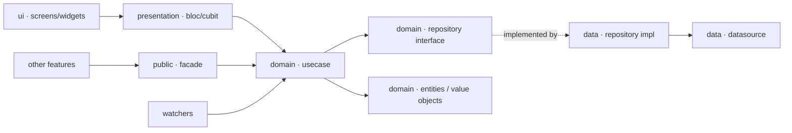

# 🏗 Architecture

This project follows a **feature-based** and **layered architecture** to ensure **separation of concerns**, **scalability** and **maintainability**.

This document describes a **target we move toward, not a finished state.** The codebase is mid-migration and carries legacy that predates these rules — that's expected, and we say so openly (see "How the codebase actually looks today"). We're not chasing a perfect snapshot; we make it **better one iteration at a time.** The rule of thumb: leave every file you touch a little cleaner than you found it and converge it toward the architecture described here — and never replicate legacy just because it's there.

> **New here? Read in this order:** **Feature-Based Architecture** → **How the codebase actually looks today** (the honest snapshot) → **Entry points & code tour** (find your way around the code) → **The architecture we tend toward** (the rules you apply daily). The rest is reference.
>
> **Repo doc map:** [README.md](README.md) = the product · **ARCHITECTURE.md** (this file) = the layer model & design rules · [AGENTS.md](AGENTS.md) = toolchain, commits, naming, the day-to-day contract · [FEATURES.md](FEATURES.md) = the cross-feature dependency graph.

**Contents:** Feature-Based Architecture · How the codebase actually looks today · Entry points & code tour · The architecture we tend toward (logic homes · use-cases · repositories · datasources · entity/model · vertical slice · errors · facade · convergence) · Layer glossary · Feature & package templates (incl. *Adding a feature* checklist) · Monorepo Migration · Rules for AI.

## 📦 Feature-Based Architecture

Features are self-contained modules that encapsulate all code related to a specific functionality, domain, or resource of the application.

A feature is the single owner of its domain, meaning it is solely responsible for enforcing all business rules and domain logic related to that domain. No other feature may directly access or modify a feature’s internal domain models, state, or persistence details.

When other features need to interact with a domain, the feature should expose a well-defined public API (facade) that serves as the only entry point for cross-feature interaction. This facade defines the feature’s stable contract and ensures that business rules cannot be bypassed. And as long as the facade remains unchanged, the feature’s internal implementation can evolve freely without impacting dependent features.

This approach enables clear ownership, strong encapsulation, and independent development and testing of features. It also helps in maintaining a well-defined, acyclic dependency graph between features, preventing circular dependencies as visualized in the [Features Dependency Diagram](FEATURES.md), this diagram should be updated as the application evolve.

## 🧭 How the codebase actually looks today

> Honest snapshot (directory census, 2026-06). Read this before assuming the sections below describe what already exists — they describe where we are heading. Numbers are approximate (`≈`) and will drift.

The codebase has **two coexisting patterns**, which is expected mid-migration:

**1. The dominant pattern — `ui → bloc → usecase → repository → datasource`** (calls flow down; data flows back up). Most shared *data + domain* lives in `lib/core/<domain>/` (≈30 domains, ≈20 datasources, ≈26 repositories, ≈167 use-case files app-wide — most in `lib/core`, ≈21 features carry their own — ~80% under `domain/usecases/`). Most *features* in `lib/features/<feature>/` are **presentation + ui** (bloc/cubit in ≈44 of 48 features) that consume `lib/core`. The shape: a datasource per external system, an abstract repository with its implementation, use-cases, a bloc on top, `get_it` for wiring. It is simple, uniform, and well understood — **this is the pattern we consolidate on.**

**2. A minority drifted to a heavier hexagonal split (≈6 modules: `labels`, `electrum_settings`, `fund_exchange`, `recipients`, `transactions`, `broadcast_signed_tx`).** Extra rings — `application/` (use-cases + ports), `adapters/`, `frameworks/`, `interface_adapters/` — plus per-layer error types and several model+mapper hops. More files, more vocabulary, no extra capability. **We converge these back** onto pattern 1 (see "Convergence" below).

**Two things barely exist yet:** the `public/` facade (≈1 feature) and `watchers/` (≈1 feature). So "facade-only cross-feature" is currently aspiration, not reality — features still reach into each other directly in places, which we are fixing.

This split maps almost 1:1 onto the melos target (see Monorepo Migration): `lib/core/<domain>` → `packages/<domain>` (shared data + domain, no UI), `lib/features/<feature>` → `features/<feature>` (presentation + ui). The migration is mostly a **relocation**, not a rewrite.

## 🚪 Entry points & code tour

New to the code? Start at these three files — together they are the app's **composition root**:

- **`lib/main.dart`** — process entry. `Bull.init()` runs before `runApp()`: logging → error reporting (Sentry, consent-gated through the first-run wizard) → Flutter-Rust-Bridge / `bull_sdk` init → `initLocator()` → wizard flush. Then `runApp()` provides the always-on top-level blocs (app-startup, wallet, settings, bitcoin-price, exchange).
- **`lib/locator.dart`** — dependency injection (`get_it`). `AppLocator.setup()` registers **core first** (`CoreLocator` — datasources, ports, repositories, services, use-cases, facades), then calls **every feature's `<Feature>Locator.setup(locator)`**. This file is the single list of what's wired into the app.
- **`lib/router.dart`** — navigation (`GoRouter`). `AppRouter.router` starts at `WalletRoute.walletHome`, wraps the app in a root `ShellRoute`, and **spreads each feature's routes** (`...ExchangeRouter.routes`, `...BuyRouter.routes`, …) into the tree.

Each feature mirrors that with three plug-in points: **`<feature>_locator.dart`** (a `<Feature>Locator.setup(locator)` registering the feature's deps), **`<feature>_router.dart`** (a `<Feature>Router` exposing `route`/`routes` + a `<Feature>Route` enum of paths), and — only when consumed by other features — **`<feature>_facade.dart`**. To understand any feature, trace it top-down: **route → screen (`ui/`) → bloc (`presentation/`) → use-case (`domain/usecases/`) → repository → datasource.** The "vertical slice" below walks one real example end to end.

Shared infrastructure and shared domain live in `lib/core/<domain>/` (see "Special Note on Core Module"); per-flow UI lives in `lib/features/<feature>/`.

## 🎯 The architecture we tend toward

One pattern, everywhere: **`ui → bloc → usecase → repository → datasource`.** The vocabulary stays the one the team already uses — `datasource`, `repository`, `usecase`, `bloc` — with **no `port` / `adapter` / `application` / `framework` renaming**.

This is the same spine the **Flutter team's** official [app-architecture guide](https://docs.flutter.dev/app-architecture) *strongly recommends*: a repository-based **data layer** and an MVVM **UI layer** ([recommendations](https://docs.flutter.dev/app-architecture/recommendations)). Our **bloc/cubit plays the ViewModel role** — this mapping is ours; the official docs are state-management-agnostic and never name BLoC. We also adopt its other *strongly recommend* items: **abstract repository classes**, **immutable models**, **unidirectional data flow**, **dependency injection**, **no logic in widgets**, and **fakes for testing**.

### The rule that matters most: where does logic live?

"Too much logic in use-cases" is the symptom of logic sitting in the wrong layer. There are **three homes**, and the fix is to put each kind where it belongs — not to push everything into repositories (that just makes god-repositories):

| Home | What lives here | Litmus test |
|---|---|---|
| **Domain** (entities, value objects) | invariants **intrinsic** to one type, always true | "True regardless of the use-case?" → `Amount` ≥ 0, address format, xpub validity |
| **Repository** | **data** logic for one type: combine datasources, cache, map model↔entity, single source of truth | "Depends on *how we store/fetch* this type?" → "fetch UTXOs by merging Electrum + local DB and map to `Utxo`" |
| **Use-case** | **orchestration**: coordinate multiple repositories, multi-step workflow, flow decisions | "Coordinates several repositories / describes one user goal?" → coin-selection + build PSBT + sign + broadcast |

So: **rich domain models**, **repositories that own data-shaping**, and **thin use-cases that only orchestrate**. A 100-line use-case coordinating several repositories with rollback is fine — that *is* orchestration. A use-case that maps one model to another, or re-checks an invariant the entity already guarantees, is misplaced logic — push it down. This three-way split is the single biggest improvement we are making.

### Use-cases: always present, kept thin

Every call from the UI goes `bloc → usecase → repository`. **A bloc never imports a repository or a datasource directly** — the use-case is the stable, testable seam between presentation and data, and the place where data-layer errors are mapped to feature errors. This uniformity is deliberate: one shape to learn, one shape to review, across all 48 features.

Keeping the use-case *thin* (per the table above) is what prevents the "use-cases are overhead" trap the Flutter team warns about — the overhead is logic with no home, not the seam itself. The Flutter team rates a dedicated domain/use-case layer *Conditional* ("in most apps they add unnecessary overhead", [recommendations](https://docs.flutter.dev/app-architecture/recommendations)); we knowingly accept that small, uniform cost in exchange for one predictable pattern, and we pay it back by keeping use-cases thin.

- **Owns:** coordinating **multiple** repositories/ports, sequencing a multi-step workflow, and **mapping data-layer errors → the feature's `<Feature>Failure`** (when wrapping a shared core repo that still throws; a feature-local repo maps at the repo boundary).
- **Never:** shaping data, re-checking an invariant the entity's constructor already guarantees, or touching a datasource.
- **Smell:** a use-case that imports from `data/`; a use-case that re-validates what the entity already enforces.

The entry method is **`execute(...)`** — the codebase convention (206 of 209 use-cases; not `call`), one public method per use-case. Real example: `GetWalletUtxosUsecase.execute(walletId)`. A one-line use-case that merely forwards to a repository is **fine** — it is the uniform, testable seam where errors get mapped, not dead weight; that uniformity is worth more than saving a file.

### Repositories: abstract interface in `domain/`, implementation in `data/`

The repository is the data **seam** and the single source of truth for one data type ([data-layer](https://docs.flutter.dev/app-architecture/case-study/data-layer)). Declare it as an **`abstract interface class`** so the compiler enforces the contract and implementations can be swapped (regtest / mock / production).

- **Interface (the contract):** `domain/repositories/<noun>_repository.dart` — the single `repositories/` folder. It imports only domain types, so `domain` never depends on `data`. This is the Dependency Inversion Principle: the contract belongs with its consumer, the use-case.
- **Implementation:** `data/<noun>_repository_impl.dart`, next to the datasources it wraps. There is **no second folder named `repositories`**.

> **Source / trade-off.** The Flutter team's case study puts the abstract class *and* its implementations together in `data/repositories/<entity>/` and keeps `domain/` for models only — `BookingRepository` + `BookingRepositoryRemote` + `BookingRepositoryLocal` all in `data/` ([data-layer](https://docs.flutter.dev/app-architecture/case-study/data-layer), folder tree in the [case study](https://docs.flutter.dev/app-architecture/case-study)). We deviate on purpose: because we keep a real use-case layer in `domain/`, the interface lives in `domain/` so the dependency rule holds. It is the same Ports-&-Adapters idea — interface = port, impl = adapter — expressed in our vocabulary and without a duplicate `repositories/` folder.

**The boundary rule — this one never bends.** A repository's **public signatures — returns *and* params — use only domain types**: entities, value objects, `Result<Entity, …>`. Wire models, library types (a BDK `LocalUtxo`, an LWK type, a Drift row), JSON `Map`s and DTOs **never cross the repository boundary** — they live and die inside `data/`. This is *why* entity and model stay separate (see "Entity vs. model" below); it is not abstraction for its own sake. *(Legacy leak to converge: `WalletAddressRepository` takes a `WalletModel` param — a `data/` model in a `domain/` contract; new code passes an id or an entity instead.)*

- **Owns:** combining its datasources, caching, and **mapping wire model ↔ domain entity**; the single source of truth for one type. Real example: `WalletUtxoRepositoryImpl` injects four datasources (metadata, BDK, LWK, frozen-utxo) plus the labels facade, picks BDK-vs-LWK from wallet metadata, maps `WalletUtxoModel → WalletUtxo`, and returns `List<WalletUtxo>`.
- **Never:** orchestrate a user goal across **other repositories**, or sequence a multi-step workflow — that is a use-case.
- **Smell:** a repository importing another repository; a "god repository" of unrelated methods; data-shaping leaking up into a use-case.

### Datasources: one external system each, private to the repository

A `datasource` wraps exactly one external system (Drift, BDK, an Electrum socket, an HTTP API), is stateless, and is a **private member of its repository** — bloc and UI can never reach it directly ([data-layer](https://docs.flutter.dev/app-architecture/case-study/data-layer): *"the service is a private member, so that the UI layer can't bypass the repository"*).

- **Owns:** that one system's calls, returning its **wire/persistence shape** — a `*Model`, a `Map`, or a library type. `BdkWalletDatasource.getUtxos()` returns `WalletUtxoModel`s, never domain `WalletUtxo`s.
- **Never:** combine two systems, decide policy, cache across calls, or map to a domain entity. One datasource never imports another.
- **Smell:** a datasource returning a domain entity; a datasource calling another datasource.

### Entity vs. model: always two, always separated

Every persisted or transferred record has **two** types, kept apart — never one class doing both domain and wire duty. The split exists to serve the repository boundary rule above: the repository hands out **entities**, the datasource speaks the **wire shape**, and the model is that wire shape, which must never escape `data/`.

- **Entity** (`domain/entities/`) — what the app reasons about. **Rich and self-validating: an invalid instance must be impossible to construct.** Enforce invariants in the constructor — with freezed, in a **factory** that validates then delegates to the private `._()` constructor, or by composing validated **value objects** (`Amount`, `Address`, fee rate). It carries behavior and getters (e.g. `WalletUtxo.address` resolves per sealed variant). It has **no** `fromJson`/`toJson`, **no** Drift annotations, and **no** awareness of how it is stored.
- **Model** (`data/models/`) — the wire/persistence shape. Mirrors the external/stored structure (a JSON envelope, a Drift row, a BDK/LWK library type). **Pure data: serialization only** (freezed `fromJson`/`toJson`, Drift) — no business rules, no validation beyond parsing.
- **Mapper** (`data/mappers/`) — the one place the two meet; translates model ↔ entity. Its own **file** once it earns one (rule #14 in AGENTS.md), an extension or inline mapping when it is trivial.

**Why two even when they look identical:** they change for **different reasons**. The model changes when the API or DB schema changes; the entity changes when the domain rules change. Fuse them and a renamed JSON field ripples into domain logic, or a domain invariant leaks into serialization. The Flutter team rates separate models *Conditional* ("adds verbosity… use in large apps", [recommendations](https://docs.flutter.dev/app-architecture/recommendations)) — **we deliberately make it mandatory**: in a self-custodial wallet the wire/DB shape and the domain shape must stay free to diverge safely. The cost is one mapper; the payoff is each side has exactly one reason to change.

**This is not over-abstraction.** Over-abstraction is *extra layers* — a repository **and** datasource for trivial CRUD, a mapper *file* for a one-line map, a request/response-DTO explosion. The entity/model split is the one boundary you never collapse. The cap stays **two types per record** (entity + wire model); the five-types-per-record shape (entity / value-object / primitive / request-DTO / response-DTO + a mapper between each) is the verbosity to collapse. Value objects are for correctness-critical primitives — amount/sats, address, fee rate — not every field.

**Target shape (the `wallet` types, with the impl in `data/` per the no-`repositories/`-folder rule above):**

```
wallet/
  domain/entities/wallet_utxo.dart       # WalletUtxo — sealed, rich, invariants guaranteed
  data/
    models/wallet_utxo_model.dart        # WalletUtxoModel — freezed wire/persistence DTO
    mappers/wallet_utxo_mapper.dart      # WalletUtxoModel ↔ WalletUtxo
    wallet_utxo_repository_impl.dart     # (legacy lives under data/repositories/ — converge)
```

**An entity that cannot hold a bad value** (illustrative — shared value objects belong in `lib/core/primitives/`):

```dart
class Amount {
  final BigInt sats;
  Amount(this.sats) {
    if (sats < BigInt.zero) throw ArgumentError('Amount cannot be negative');
  }
}
// A freezed entity validates in a factory, then delegates to the private ._() constructor.
```

### A vertical slice, end to end

How the layers hand off on a real read — fetching a wallet's UTXOs:

```
ui  ── user opens a screen that lists coins
 └─ bloc       e.g. SendCubit / SellBloc   holds List<WalletUtxo> in state; no logic
     └─ usecase  GetWalletUtxosUsecase.execute(walletId)
                  coordinates, maps failures → WalletFailure
         └─ repo  WalletUtxoRepository.getWalletUtxos(walletId)     [interface: domain/]
             │     impl merges datasources, maps model → entity     [impl: data/]
             ├─ datasource  WalletMetadataDatasource              → WalletMetadataModel
             ├─ datasource  BdkWalletDatasource / LwkWalletDatasource → WalletUtxoModel
             └─ datasource  FrozenWalletUtxoDatasource            → frozen utxo ids
```

Calls flow **down**; data flows **up**, transformed once per boundary: **wire model** (datasource) → **domain entity** (repository) → **UI state** (bloc). Each downward arrow is a call into a narrower contract; each upward return crosses exactly one boundary and changes type exactly once. The bloc never sees a `*Model`; the datasource never sees an entity.

### Error handling

Three words, three jobs, kept strictly apart: **`Exception`** = thrown, low-level, recoverable (data layer, caught at the boundary); **`Error`** = a `dart:core` programmer bug, never caught (crashes → Sentry); **`Failure`** = a modeled, recoverable **value** that lives in `domain/` and is the only error kind the UI ever sees. `Error` is **never** a domain type — name domain failures `<Feature>Failure`, never `<Feature>Error`.

- **One sealed `Failure` family per feature** in `domain/<feature>_failure.dart` (`sealed class <Feature>Failure extends Failure`), **Flutter-free**. Most features aren't deep enough to justify a family per layer. Cross-cutting modes (network, storage-locked, not-found, timeout, auth, device, insufficient-funds) come from the shared `sealed CoreFailure` in `lib/core/failures/` (alongside the `Failure` base; the legacy `lib/core/errors/` is the graveyard until emptied), composed rather than redefined per feature. Map foreign errors at the boundary; never leak another layer's or feature's type.
- **Translation lives in presentation, not on the failure.** Because the repository (data layer) constructs the failure, the failure type must stay Flutter-free — so `toTranslated(BuildContext)` is a **presentation-layer extension** (`presentation/<feature>_failure_x.dart`), the only place that imports `flutter` / `context.loc`. The `sealed` switch in the extension still makes a missing user message a compile error. **The end user never sees a dev string:** the catch-all variant returns a **generic** localized message (`context.loc.oopsSomethingWentWrong`), never the raw `logMessage` — that text is logged at the boundary and is for us only. (`unexpected: (message) => message` leaks dev detail; the anti-pattern to avoid.)
- **`Result<T, F extends Failure>` at the boundary** for expected, recoverable failures (variants `Ok` / `Err`; `throw` only for `dart:core`-style programmer bugs). Dart exceptions are unchecked — callers aren't forced to handle them ([dart.dev](https://dart.dev/language/error-handling)) — so a `Result` makes failure explicit in the signature ([Flutter Result](https://docs.flutter.dev/app-architecture/design-patterns/result)). Generic over `F` so consumers never cast; annotate returning methods `@useResult`; helpers `fold` / `map` / `mapErr`.
- **The flow, end to end.** The **repository** is the one `try/catch`: it catches the foreign `Exception`, logs the raw reason, maps it to the feature's `<Feature>Failure`, and returns `Result<T, F>`. *(When a feature wraps a shared **core** repo that still throws, this mapping moves up to the feature's **use-case** — the first layer the feature owns.)* The **use-case** forwards or composes `Result`s (no `try/catch`). The **bloc** consumes with an exhaustive `switch`, storing the typed `<Feature>Failure` in state — no cast, no `BuildContext`. The **UI** renders `failure.toTranslated(context)`. A domain `Failure` in the bloc is correct (presentation → domain), not a leak; the leak prevented is a *data* exception crossing the boundary.

> **Migration (#1895).** Sanitizing user-facing errors to this standard is a **sanctioned, staged migration** (issue #1895), not opportunistic. Existing features still using `BullException`, `<Feature>Error` naming, `toTranslated` *on* the error, or `throw`-based propagation are **legacy-to-converge** — don't replicate them; bring a feature fully in line when you touch it, one feature per PR.

### The facade: a feature's public contract

A feature never reaches into another feature's `domain/`, `data/`, or `presentation/`. Its single cross-feature surface is the **facade**, and the facade *is* the interface between features — a **concrete class**, not an `abstract interface class`. There is nothing to define on top of it: its public method surface plus its `export` block **are** the contract. (Reach for an `abstract interface class` in front of a facade only to break a dependency cycle via DIP, or to mock the feature in another feature's tests — not by default.)

The `export` block is the feature's whole public surface — its published types, any widgets meant for cross-feature reuse, its router and locator. `LabelsFacade` exports `label.dart`, its label UI, `router.dart`, and `locator.dart`; everything else under `labels/` is unreachable from outside.

**What its methods may return — the repository boundary rule, one level up:**

- Only the feature's **published contract types**, which must be in the `export` block so callers can name them.
- **Never** a deeper internal type: an `application/`/use-case type, a `data/models/` model, or another feature's entity. `LabelsFacade` maps its internal application label to the exported `Label` (`LabelMapper.applicationLabelToLabel`) before returning — the internal type never crosses the boundary.

**Is the published type the entity itself or a dedicated DTO? A stability call, not a rule:**

- **Entity as the published type** (lighter default): a clean, stable entity can be exported and returned directly — no extra type, no mapper. Don't add ceremony you don't need.
- **Dedicated published type + mapper** (what `labels` does): when the internal entity carries internal-only fields (DB ids, internal flags) or churns often, expose a separate public type and map to it, so consumers are insulated from internal change.

Either way: the return type is exported, carries no internal-only fields, and the **consuming feature wraps the facade call in its own use-case** — a bloc never calls another feature's facade directly (see "Business Logic in Presentation Layer" below). Under the melos target the facade graduates into the package's exported API (`lib/<name>.dart`, `export 'src/…' show …`) — the same contract, then enforced by package privacy.

### Convergence (the ≈6 hexagonal modules)

Map the heavier vocabulary back onto the consolidated one — opportunistically, never a big-bang, never in an unrelated PR:

| Hexagonal (today) | Consolidated (target) |
|---|---|
| `application/usecases/` | `domain/usecases/` |
| `application/` ports | `domain/repositories/` (or `domain/` for non-repo ports) |
| `adapters/` (repo impls) | `data/<noun>_repository_impl.dart` |
| `frameworks/` (datasources, drivers) | `data/datasources/` |
| `interface_adapters/` | `presentation/` + `ui/` |

What is deprecated is the hexagonal **folders** above, not the word "port". Both a repository and a non-repository port are `abstract` domain interfaces living in `domain/` with their implementation in `data/`, and in Ports-&-Adapters terms a repository *is* a port. The convention splits them by **what they abstract**:

- A **repository** owns a **data type**: it is the single source of truth for one entity, shaped around fetch / persist / cache and model↔entity mapping. *Litmus: "does it store and retrieve a domain entity?"* Name it `<Noun>Repository` (never `<Noun>Port`).
- A **non-repository port** abstracts a **capability** — an action or external service with no entity ownership and no source-of-truth role. *Litmus: "is it a verb/service rather than a data type I own?"* Examples in the codebase: `BlockchainPort.broadcastLiquidTransaction`, `ElectrumConnectivityPort.checkServersInUseAreOnline`, `SocketPort.connect`. Keep the `Port` suffix and name it `<Capability>Port`.

The repository's own interface is the canonical port (the Ports-&-Adapters analogy in "Repositories" above); we just give it the `<Noun>Repository` name. Reach for a `Port` only when no entity is being owned — otherwise it is a repository.

## 🗂️ Layer glossary (our terms)

- `domain/entities/` — entities and value objects; **rich** models that enforce their own invariants in the constructor/factory (an invalid instance can't exist), never anemic DB mirrors. Never carry serialization — that's the model's job.
- `domain/repositories/` — the **abstract** repository interfaces (the contracts use-cases depend on).
- `domain/usecases/` — one per user intent; **thin orchestration** only.
- `domain/<feature>_failure.dart` — the feature's sealed `Failure` family (Flutter-free); its `toTranslated(context)` lives in a `presentation/<feature>_failure_x.dart` extension, never on the failure itself.
- `data/datasources/` — stateless wrappers around one external system each; private to their repository.
- `data/<noun>_repository_impl.dart` — the concrete repository implementation.
- `data/models/` — the wire/persistence model, one per entity, always separate from the domain entity (serialization only). `data/mappers/` — model ↔ entity; a file only once it earns one (rule #14), inline/extension when trivial.
- `presentation/` — bloc/cubit + state + event. The ViewModel: holds UI state, exposes intents, calls use-cases. Thin — no business decisions.
- `ui/` — screens + widgets; depend on the bloc only.
- `public/` — the feature's facade: the only entry point other features may import.
- `watchers/` — optional event listeners that drive use-cases (never repositories directly).

## 🧩 Feature & package templates

**Canonical feature (self-contained, owns its data):**

```
<feature>/
  domain/
    entities/         # (+ value objects) — rich models
    repositories/     # abstract interfaces (the contracts)
    usecases/         # one per intent, thin orchestration
    <feature>_failure.dart   # sealed Failure family, Flutter-free
  data/
    datasources/      # one external system each, private to the repo
    models/           # wire/persistence model, always separate from the entity
    mappers/          # model ↔ entity (a file only once it earns one)
    <noun>_repository_impl.dart
  presentation/       # <feature>_bloc.dart + state + event + <feature>_failure_x.dart (toTranslated)
  ui/
    screens/
    widgets/
  public/             # <feature>_facade.dart — only if consumed cross-feature
  <feature>_locator.dart
```

The canonical flow, end to end:


```mermaid
graph LR
    UI[ui · screens/widgets] --> P[presentation · bloc/cubit]
    OF[other features] --> F[public · facade]
    P --> UC[domain · usecase]
    F --> UC
    W[watchers] --> UC
    UC --> R[domain · repository interface]
    UC --> E[domain · entities / value objects]
    R -.implemented by.-> IMPL[data · repository impl]
    IMPL --> DS[data · datasource]
```

A feature whose data is **shared** does not hold `domain/` + `data/` itself — it consumes a package (below). A feature with **private** data keeps the full stack. The dividing line is one question: *is this data used by more than one feature?*

### Adding a feature: the checklist

For a new user-facing flow in `lib/features/<feature>/`, working **outside-in is fine but design domain-first**:

1. **Domain.** Rich entity + value objects (`domain/entities/`), the `abstract interface class <Noun>Repository` (`domain/repositories/`), the sealed `<feature>_failure.dart` (`<Feature>Failure extends Failure`, Flutter-free — translation comes later as a presentation extension), and one `<Verb><Noun>Usecase` per intent (entry method `execute(...)`).
2. **Data.** Datasource(s) (`data/datasources/`, one external system each), wire model + mapper (`data/models/`, `data/mappers/`), and `<noun>_repository_impl.dart`. The repository returns entities only — never a model (see "boundary rule").
3. **Presentation.** `<Feature>Bloc`/`Cubit` + sealed state/event, plus the `<feature>_failure_x.dart` extension exposing `toTranslated(BuildContext)` (`presentation/`). The bloc stores the `<Feature>Failure` in state; it calls use-cases only — never a repository or datasource.
4. **UI.** Screens/widgets (`ui/`), reusing `lib/core/widgets/` first; all strings via `context.loc.<key>`, all colors from the theme (see AGENTS.md "UI Kit").
5. **Wire it in** (the two composition-root files from "Entry points & code tour"): add `<feature>_locator.dart` and register `<Feature>Locator.setup(locator)` in **`lib/locator.dart`**; add `<feature>_router.dart` (`<Feature>Router` + `<Feature>Route`) and spread `...<Feature>Router.routes` into **`lib/router.dart`**.
6. **Expose only if cross-feature.** Add `public/<feature>_facade.dart` returning published types only (see "The facade"), and update the graph in [FEATURES.md](FEATURES.md).
7. **Generate & test.** `make build-runner` (freezed/drift/json codegen); unit-test every use-case and entity-with-rules (`make unit-test`); add l10n keys and run `make translations`.

**Package (shared foundation — `packages/<name>`):** the `domain/` + `data/` half of the *same* shape, **with no `presentation/` and no `ui/`**. It exposes its repository interfaces, domain types, and shared use-cases through its public API (`lib/<name>.dart`); everything else stays under `lib/src/`. The single Flutter exception is a package that owns a sealed UI widget (see the "Sealed UI" note under Monorepo Migration).

> The one hard line between the two shapes: **a package never exports a bloc or a full screen** (the sole exception is the sealed-UI widget — e.g. `MnemonicView` — described under Monorepo Migration). Everything else — datasource, repository, domain, shared use-case — can live in either.

### Enforcing the rules (turn conventions into compile/lint errors)

| Rule | Lever |
|---|---|
| Repository is a contract | `abstract interface class <Noun>Repository` (Dart class modifiers) — the compiler forbids `extends`, forces `implements` |
| Exhaustive failure/state handling | `sealed class <Feature>Failure` / sealed states — a missing `switch` case is a compile error |
| A returned `Result` must be handled | `@useResult` (`package:meta`) on repo methods — the analyzer warns if the result is discarded |
| Cross-feature facade-only | melos package boundaries + the `implementation_imports` lint (a package's `src/` is unreachable from outside); an analyzer-plugin or `custom_lint` rule for in-`lib/` features |
| Bloc never imports `data/` | an analyzer-plugin or `custom_lint` rule banning `data/` imports from `presentation/` + `ui/` |
| Lock a contract's capabilities | `@Deprecated.implement()` / `.instantiate()` / `.extend()` on a base class (Dart 3.10+) — analyzer warns on the forbidden capability |
| Whole-project gate | `analysis_options.yaml` + `flutter analyze --fatal-infos` in CI and the pre-commit hook |

The pairing that does the heavy lifting: **`abstract interface class` + `sealed` + `@useResult` + a layering lint + melos boundaries** — all available in the current toolchain (Flutter 3.41/3.44 bundle Dart 3.11/3.12), none requiring a specific point release. Two of these landed in **Dart 3.10** and are simply available to us now: the first-party **analyzer plugin system** — author a layering rule (e.g. ban `data/` imports from `presentation/`) that also ships IDE quick-fixes, the supported successor to third-party `custom_lint`; and fine-grained **`@Deprecated.*`** capability annotations to lock a contract (implementable but not extendable, etc.). Nothing in 3.41/3.44 itself is *required* — they introduce no new architecture-enforcement capability beyond what 3.10 already gave us.

### Special Note on Core Module

`/lib/core` is a shared technical module of low-level primitives/drivers/helpers, not the "core" business logic; it must stay independent of any feature-specific logic. Historically `lib/core` also accreted shared *domain* modules (e.g. `wallet`, `secrets`) — those are exactly what graduate into `packages/<domain>` under the melos migration. What remains in `lib/core` stays infrastructure-only.

## 🔺 Common Architectural Pitfalls

While the architecture described above represents our current standards, the codebase contains legacy code that predates these principles. We're actively refactoring to align with these standards. When working in the codebase, watch out for—and avoid replicating—these common anti-patterns:

**Breaking Feature Boundaries**

- **Problem**: Features directly import usecases, domain models, repositories, or services from other features
- **Impact**: Creates tight coupling, bypasses business rules, and leads to circular dependencies
- **Solution**: Always define and use a public facade for cross-feature communication

**Business Logic in Presentation Layer**

- **Problem**: BLoCs/Cubits contain orchestration logic, decision-making, or complex transformations that belong in use cases
- **Impact**: Makes business logic untestable in isolation, duplicates logic across features, and indicates poorly defined or too coarse-grained use cases
- **Root Cause**: Often happens when directly using other features' use cases instead of creating feature-specific orchestration
- **Solution**: Keep BLoCs thin—they should only transform between UI state and use-case calls; a BLoC never calls a repository or datasource directly

**Bypassing the use-case layer**

- **Problem**: Watchers (or other UI-side drivers) invoke repositories directly, creating flows like `watcher → repository → datasource` that skip the use-case seam
- **Impact**: Business rules and error-mapping that belong in the use-case get bypassed
- **Example**: Payjoin and swap datasources managing event streams with watchers listening directly
- **Solution**: Watchers invoke use-cases, which then use repositories: `watcher → use-case → repository`

**Core Module Bloat**

- **Problem**: Feature-specific business logic placed in `/core`
- **Impact**: Creates implicit coupling and makes core non-reusable across projects
- **Solution**: Keep core limited to generic primitives, low level drivers, and infrastructure helpers with no business logic

**Anemic Domain Models**

- **Problem**: Entities defined as simple data containers (DTOs) that mirror database schemas without encapsulating business rules
- **Impact**: Business logic scatters into services/use cases instead of living in the domain where it belongs
- **Solution**: Entities should encapsulate business rules and be independent of persistence concerns

**Over-Abstraction (repository + datasource for trivial CRUD)**

- **Problem**: Unnecessary layers (e.g., both repository AND datasource for simple CRUD operations)
- **Impact**: Adds complexity and indirection without meaningful benefit
- **Solution**: Use a single repository if there's no meaningful transformation or clear logic to separate

**State Management Confusion**

- **Problem**: Mixing ephemeral widget state with BLoC state
- **Impact**: Makes state management unpredictable and harder to test
- **Solution**: Use local widget state (StatefulWidget) for UI-only concerns; use BLoC only for business state

## 📦 Monorepo Migration (melos workspace)

The codebase is migrating, incrementally, from a single Flutter package to a [melos](https://melos.invertase.dev/) pub-workspace. This is an organizational change layered on top of the architecture above — it does not alter the feature-based / layered rules, it gives them a stronger, compile-time boundary.

**Current state (skeleton).** The app remains a single package at the repo root, declared as the workspace package via `useRootAsPackage: true` in the `melos:` block of `pubspec.yaml`. No code has moved yet. `packages/` and `features/` exist as reserved, empty homes.

**Target layout.** As modules are extracted (one at a time, never a big-bang), they become pub-workspace members:

- **root = the app shell** — thin: routing, DI/get_it wiring, and composition of feature packages. It ships no domain or UI of its own beyond that wiring.
- **`features/`** — Flutter packages, one per user-facing flow (`send`, `receive`, `buy`, `sell`, `recoverbull`, …). Each owns its domain behind its `public/` facade and is mounted into the shell (routes + DI). A feature may carry an `example/` mini-app to run it in isolation during development; the shipped artifact is the shell embedding the feature, not a standalone app.
- **`packages/`** — pure-Dart packages with no Flutter UI: the shared foundation consumed by features. This is both shared domain (`wallet`, `secrets`) and infrastructure (`storage`, `electrum`, `blockchain`, …). The lone exception is a package that must own a sealed UI component (see "Sealed UI" below), which may depend on Flutter.

Each extracted package gets `resolution: workspace` and is listed under a `workspace:` key in the root `pubspec.yaml`; the root app keeps `useRootAsPackage: true` and consumes the members. Dependencies point one way and stay acyclic: **shell → features → packages**. `packages/` never import `features/`; a feature touches a package only through its published API.

**Why it matters for architecture.** Package boundaries turn the existing rules into *enforced* ones rather than conventions:

- The **Dependency Rule** and **acyclic feature graph** become compile errors when violated — a `packages/` infrastructure package physically cannot import a `features/` module, and a feature cannot reach into another feature's internals (only its published API is importable).
- **Core-as-infrastructure-only** (AGENTS.md rule #7) is enforced by construction: `packages/` members declare no dependency on `features/`.
- The **facade-only cross-feature** rule (AGENTS.md rule #1) is backed by Dart's package privacy — only what a feature package exports is reachable.

**Encapsulation is enforced, not conventional.** Each package exposes a curated public API in `lib/<name>.dart` (`export 'src/…' show …`); everything under `lib/src/` is package-internal. Importing another package's `src/` trips the `implementation_imports` lint, which CI (`flutter analyze --fatal-infos`) and the pre-commit hook turn into a failure — and CI forbids bypassing it with `// ignore`. The most sensitive internals stay library-private (`_`) so they are not in any importable library at all.

**Sealed UI as a security tool.** A package can expose a *widget* that uses a secret internally without ever exposing the secret value. The mnemonic-display case is the canonical example: `secrets` exports a `MnemonicView` widget but no function that returns the words. The mnemonic lives only in `lib/src/`, is read inside the widget's `build`, and never crosses the package boundary — so a feature developer can show the user their words but cannot obtain them programmatically. Because Dart has no cross-package "friend" visibility, the widget must live in the same package that holds the seed, which is why `secrets` is the one package allowed to depend on Flutter. This seal stops programmatic/API leakage only — not OS-level capture; pair it with screenshot blocking (`no_screenshot`), exclusion from the accessibility/semantics tree, and treating the revealed value as ephemeral.

This is a slow, deliberate migration. Until a module is extracted, it stays in `lib/` and follows the same rules it does today. Do not move code into `packages/`/`features/` opportunistically — extraction is its own scoped, reviewed change with the security/bitcoin/build implications considered per module.

## 🤖 Rules for AI

See [AGENTS.md](AGENTS.md) — architecture enforcement, theme-only colors, refuse-and-suggest on rule breaks, offering a scoped refactor when you touch non-compliant code (separate commit, dev decides), and unit-test requirements for use cases and entities are documented there alongside the rest of the agent contract.
