# Feature Dependencies

This diagram shows the dependencies between features in the Bull Bitcoin Mobile application. It helps visualize the dependency graph and ensures there are no cyclic dependencies.

**Diagram Type**: This is a **Package Dependency Diagram** (also known as Module Dependency Graph or Component Dependency Diagram in UML).

## Module Dependency Graph

```mermaid
graph TB
    %% Core infrastructure
    CORE[Core<br/>---<br/>Database, Secure Storage,<br/>API Clients, Tor Adapters, UI Kit,<br/>DI & Router setup,<br/>PIN encrypted storage,<br/>Domain Primitives/Value Objects]
    PRIMITIVES[Primitives Package]
    BULL_PAYJOIN[Bull Payjoin Package<br/>Public contract]

    %% Feature modules
    SETTINGS[Settings]
    ELECTRUM_SETTINGS[Electrum Settings]
    RECOVERBULL[RecoverBull]
    TOR[Tor<br/>Workspace Package]
    PIN_CODE[Pin Code]
    LABELS[Labels]
    SECRETS[Secrets]
    HW_WALLETS[Hardware Wallets]
    BTC_PRICE[Bitcoin Price]
    NETWORK[Network]
    BIP85[BIP85]
    FEES[Fees]
    WALLETS[Wallets]
    EXCHANGE[Exchange]
    APP_STARTUP[App Startup]
    UTXO_MGMT[UTXO Management]
    ADDRESS_MGMT[Address Management]
    RECIPIENTS[Recipients]
    FUNDING[Funding]
    BACKUPS[Backups]
    SWAPS[Swaps]
    WITHDRAWAL[Withdrawal]
    STATUS[Status]
    SEND[Send]
    RECEIVE[Receive]
    TRANSFER[Transfer]
    TX_HISTORY[Transaction History]
    BG_TASKS[Background Tasks]
    DCA[DCA]
    SELL[Sell]
    PAY[Pay]
    BUY[Buy]
    COINS[Coins / UTXOs]
    ANNOUNCEMENTS[Announcements]
    CONSOLIDATION[Consolidation]
    ALL_SEED_VIEW[All Seed View]
    APP_UNLOCK[App Unlock]
    AUTOSWAP[Autoswap]

    %% Dependencies to Core (all features depend on Core, but showing it explicitly would clutter the diagram)
    %% Instead, we note this in the documentation below

    %% Extracted package dependencies
    CORE --> PRIMITIVES
    CORE --> BULL_PAYJOIN
    BULL_PAYJOIN --> PRIMITIVES

    %% Feature-to-feature dependencies (extracted from draw.io diagram)
    ADDRESS_MGMT --> LABELS
    ALL_SEED_VIEW --> APP_UNLOCK
    ANNOUNCEMENTS --> SETTINGS
    ANNOUNCEMENTS --> SWAPS
    APP_STARTUP --> WALLETS
    APP_STARTUP --> ELECTRUM_SETTINGS
    AUTOSWAP --> SWAPS
    APP_STARTUP --> TOR
    AUTOSWAPS --> TRANSFER
    BIP85 --> SECRETS
    BIP85 --> SETTINGS
    BACKUPS --> BIP85
    BACKUPS --> TOR
    BACKUPS --> WALLETS
    BTC_PRICE --> SETTINGS
    BUY --> EXCHANGE
    BUY --> RECEIVE
    BUY --> BULL_PAYJOIN
    BUY --> TX_HISTORY
    COINS --> UTXO_MGMT
    COINS --> LABELS
    COINS --> WALLETS
    DCA --> RECEIVE
    EXCHANGE --> SETTINGS
    FEES --> NETWORK
    FUNDING --> EXCHANGE
    HW_WALLETS --> CORE
    LABELS --> CORE
    PAY --> RECIPIENTS
    PAY --> BULL_PAYJOIN
    PIN_CODE --> CORE
    RECEIVE --> BULL_PAYJOIN
    RECEIVE --> SETTINGS
    RECEIVE --> SWAPS
    RECEIVE --> TX_HISTORY
    RECIPIENTS --> EXCHANGE
    SECRETS --> CORE
    SELL --> EXCHANGE
    SELL --> BULL_PAYJOIN
    SELL --> TX_HISTORY
    SEND --> CONSOLIDATION
    SEND --> FEES
    SEND --> NETWORK
    SEND --> BULL_PAYJOIN
    SEND --> SWAPS
    SEND --> TX_HISTORY
    SEND --> UTXO_MGMT
    SEND --> WALLETS
    SETTINGS --> CORE
    SETTINGS --> BULL_PAYJOIN
    STATUS --> BULL_PAYJOIN
    STATUS --> TOR
    SWAPS --> BULL_PAYJOIN
    SWAPS --> EXCHANGE
    SWAPS --> LABELS
    SWAPS --> UTXO_MGMT
    CORE --> TOR
    WALLETS --> TOR
    WALLETS --> ELECTRUM_SETTINGS
    RECOVERBULL --> TOR
    TRANSFER --> CONSOLIDATION
    TRANSFER --> SEND
    TRANSFER --> RECEIVE
    TX_HISTORY --> BULL_PAYJOIN
    TX_HISTORY --> SWAPS
    TX_HISTORY --> WALLETS
    UTXO_MGMT --> LABELS
    UTXO_MGMT --> WALLETS
    WALLETS --> BIP85
    WALLETS --> CONSOLIDATION
    WALLETS --> HW_WALLETS
    WALLETS --> NETWORK
    WALLETS --> SECRETS
    WALLETS --> SETTINGS
    WALLETS --> SWAPS
    WITHDRAWAL --> RECIPIENTS

    %% Styling
    classDef coreStyle fill:#2d3748,stroke:#4a5568,stroke-width:3px,color:#fff
    classDef packageStyle fill:#234e52,stroke:#319795,stroke-width:2px,color:#e6fffa
    classDef featureStyle fill:#1a202c,stroke:#2d3748,stroke-width:2px,color:#e2e8f0

    class CORE coreStyle
    class PRIMITIVES,BULL_PAYJOIN,TOR packageStyle
    class SETTINGS,PIN_CODE,LABELS,SECRETS,HW_WALLETS,BTC_PRICE,NETWORK,BIP85,FEES,WALLETS,EXCHANGE,APP_STARTUP,UTXO_MGMT,ADDRESS_MGMT,RECIPIENTS,FUNDING,BACKUPS,SWAPS,WITHDRAWAL,STATUS,SEND,RECEIVE,TRANSFER,TX_HISTORY,BG_TASKS,AUTOSWAPS,DCA,SELL,PAY,BUY,COINS,ANNOUNCEMENTS,CONSOLIDATION,ALL_SEED_VIEW,APP_UNLOCK featureStyle
```

## About Package Dependency Diagrams

### What This Diagram Shows

- **Modules/Packages**: Each box represents a self-contained feature/package
- **Dependencies**: Arrows show "depends on" relationships (A → B means "A depends on B")
- **Direction**: Dependencies flow from dependent to dependency (not data flow)

### Standard Information in Package Diagrams

1. **Module Names**: Clear identification of each package/feature
2. **Dependency Direction**: Arrows indicating which module depends on which
3. **Optional Elements** (can be added):
   - Dependency type labels (e.g., "uses facade", "imports types")
   - Stereotypes like `<<core>>`, `<<feature>>`, `<<infrastructure>>`
   - Access modifiers (public/internal APIs)
   - Dependency cardinality (required vs optional)

## Dependency Rules

1. **No Cyclic Dependencies**: Features must not create circular dependency chains
2. **Core Independence**: Core must not depend on any feature
3. **Feature Isolation**: Features should communicate through well-defined facades/interfaces
4. **Layered Dependencies**: Dependencies flow one way — `shell → features → packages` across modules, and `ui → presentation → domain → data` within a feature. Under the melos migration each `lib/core/<domain>` becomes a `packages/<domain>` and these turn into compile-time boundaries. See [ARCHITECTURE.md](ARCHITECTURE.md).

## Core Dependencies

**Important**: All features implicitly depend on Core for foundational services. These dependencies are not shown in the diagram to reduce visual clutter.

### What Core Provides

1. **Infrastructure Services**:

   - Database (Drift/SQLite)
   - Secure Storage instance (Flutter Secure Storage)
   - API Clients (REST/GraphQL clients)
   - Embedded Onion adapter with isolated RecoverBull and Bitcoin Electrum `.onion` sessions
   - Explicit local SOCKS5 override for Bitcoin Electrum and encrypted backups
   - UI Kit (shared widgets, theme)
   - DI setup and interfaces (Service Locator pattern)
   - Router setup and interfaces (Navigation)
   - PIN encrypted storage

2. **Core Primitives**:
   - Canonical location: `packages/primitives`; compatibility exports remain in `lib/core` during migration.
   - Extracted examples: `Failure`, `Result`, `Fingerprint`, network types, `Outpoint`, `Sats`, and `FeeRate`. Security-domain types such as `Secret` remain future extraction work.
   - Shared types used across multiple features, avoiding redundant definitions
   - Immutable, validated value objects that ensure domain integrity

> Migration note: `lib/core` is shared infrastructure (no business logic). Shared *domain* modules that historically landed in `lib/core/<domain>` (e.g. `wallet`, `secrets`) graduate into `packages/<domain>` under the melos workspace — each exposing its repository interfaces + domain types + shared use-cases through a public API, never a bloc or screen. See [ARCHITECTURE.md](ARCHITECTURE.md).

## Key Dependency Patterns

### Central Features (Highly Depended Upon)

- **Core**: Foundation for all features
- **Tor**: `packages/bull_tor` — embedded Onion lifecycle with isolated RecoverBull and Bitcoin Electrum `.onion` sessions, plus provider-agnostic local SOCKS5 verification. Depends on Flutter for app-directory storage and an iOS plugin that excludes Tor state from backups, which are infrastructure-package exceptions in AGENTS.md
- **Wallets**: Used by Send, UTXO Management, Transaction History, Backups, App Startup
- **Secrets**: Used by Wallets, BIP85
- **Settings**: Used by Wallets, Exchange, BIP85, Bitcoin Price
- **Recipients**: Used by Pay, Withdrawal
- **UTXO Management**: Used by Send, Swaps, Payjoin

### Leaf Features (Depend on Many, Few Depend on Them)

- **Send**: Depends on Fees, Network, Payjoin, Swaps, UTXO Management, Wallets
- **Receive**: Depends on Payjoin, Swaps
- **Backups**: Depends on BIP85, Tor, Wallets

### Exchange-Related Features

- **Buy, Sell, Funding**: All depend on Exchange
- **Recipients**: Depends on Exchange

## Verification

To verify no cyclic dependencies exist, you can:

1. **Manual trace**: Follow any path through the graph - it should never return to a previously visited node
2. **Automated tools**: Use `dart pub deps` or custom dependency analysis scripts
3. **Import analysis**: Review import statements in facade/public API files

## Future Improvements

- Add dependency type labels (e.g., "uses facade", "imports primitives")
- Document which specific APIs each feature exposes
- Add dependency cardinality (required vs optional dependencies)
- Include compile-time vs runtime dependency distinction
- Add layer groupings (ui, presentation, domain, data) per [ARCHITECTURE.md](ARCHITECTURE.md)
