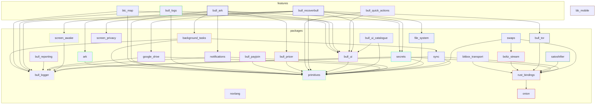

# Workspace graph

Generated by `make workspace-graph` from `fvm dart run melos list --mermaid`; do not edit by hand.

```mermaid
graph TD
  ark["ark"]
  style ark stroke:#18f150
  background_tasks["background_tasks"]
  style background_tasks stroke:#e69535
  bb_mobile["bb_mobile"]
  style bb_mobile stroke:#8b5641
  bitbox_transport["bitbox_transport"]
  style bitbox_transport stroke:#b095db
  boltz_stream["boltz_stream"]
  style boltz_stream stroke:#ec4b6c
  btc_map["btc_map"]
  style btc_map stroke:#4d7dca
  bull_ark["bull_ark"]
  style bull_ark stroke:#090577
  bull_logger["bull_logger"]
  style bull_logger stroke:#fef49a
  bull_logs["bull_logs"]
  style bull_logs stroke:#11bc41
  bull_payjoin["bull_payjoin"]
  style bull_payjoin stroke:#d00dbd
  bull_pricer["bull_pricer"]
  style bull_pricer stroke:#d15f4f
  bull_quick_actions["bull_quick_actions"]
  style bull_quick_actions stroke:#b983d0
  bull_recoverbull["bull_recoverbull"]
  style bull_recoverbull stroke:#4029c8
  bull_reporting["bull_reporting"]
  style bull_reporting stroke:#bd6d96
  bull_tor["bull_tor"]
  style bull_tor stroke:#3c5f1f
  bull_ui["bull_ui"]
  style bull_ui stroke:#ca6ae4
  bull_ui_catalogue["bull_ui_catalogue"]
  style bull_ui_catalogue stroke:#7d8de8
  file_system["file_system"]
  style file_system stroke:#2571b0
  google_drive["google_drive"]
  style google_drive stroke:#a640f1
  notifications["notifications"]
  style notifications stroke:#8f25de
  novlang["novlang"]
  style novlang stroke:#dd8ff2
  onion["onion"]
  style onion stroke:#cb1217
  primitives["primitives"]
  style primitives stroke:#5ced91
  rust_bindings["rust_bindings"]
  style rust_bindings stroke:#cc6a2f
  satoshifier["satoshifier"]
  style satoshifier stroke:#127673
  screen_awake["screen_awake"]
  style screen_awake stroke:#d2f33f
  screen_privacy["screen_privacy"]
  style screen_privacy stroke:#7725dd
  secrets["secrets"]
  style secrets stroke:#07e9ae
  swaps["swaps"]
  style swaps stroke:#3665e3
  sync["sync"]
  style sync stroke:#5262f9
  ark --> primitives
  background_tasks --> sync
  background_tasks --> bull_logger
  background_tasks --> primitives
  bitbox_transport --> rust_bindings
  boltz_stream --> rust_bindings
  btc_map --> bull_logger
  btc_map --> bull_ui
  btc_map --> primitives
  bull_ark --> ark
  bull_ark --> secrets
  bull_ark --> primitives
  bull_ark --> bull_ui
  bull_ark --> bull_pricer
  bull_ark --> background_tasks
  bull_ark --> notifications
  bull_logs --> bull_logger
  bull_logs --> bull_ui
  bull_logs --> primitives
  bull_payjoin --> primitives
  bull_pricer --> primitives
  bull_quick_actions --> bull_ui
  bull_quick_actions --> primitives
  bull_recoverbull --> primitives
  bull_recoverbull --> file_system
  bull_recoverbull --> google_drive
  bull_recoverbull --> secrets
  bull_recoverbull --> bull_logger
  bull_recoverbull --> bull_tor
  bull_recoverbull --> bull_ui
  bull_recoverbull --> screen_awake
  bull_recoverbull --> screen_privacy
  bull_reporting --> bull_logger
  bull_tor --> rust_bindings
  bull_ui --> primitives
  bull_ui_catalogue --> primitives
  bull_ui_catalogue --> bull_ui
  file_system --> primitives
  google_drive --> bull_logger
  google_drive --> primitives
  notifications --> bull_logger
  notifications --> primitives
  rust_bindings --> onion
  satoshifier --> rust_bindings
  screen_awake --> bull_logger
  secrets --> primitives
  secrets --> bull_logger
  secrets --> rust_bindings
  swaps --> rust_bindings
  swaps --> boltz_stream
  swaps --> primitives
  sync --> rust_bindings
  sync --> bull_logger
  sync --> primitives
  subgraph packages0 ["packages"]
    ark
    background_tasks
    bitbox_transport
    boltz_stream
    bull_logger
    bull_payjoin
    bull_pricer
    bull_reporting
    bull_tor
    bull_ui
    bull_ui_catalogue
    file_system
    google_drive
    notifications
    novlang
    onion
    primitives
    rust_bindings
    satoshifier
    screen_awake
    screen_privacy
    secrets
    swaps
    sync
  end
  subgraph features1 ["features"]
    btc_map
    bull_ark
    bull_logs
    bull_quick_actions
    bull_recoverbull
  end
```
