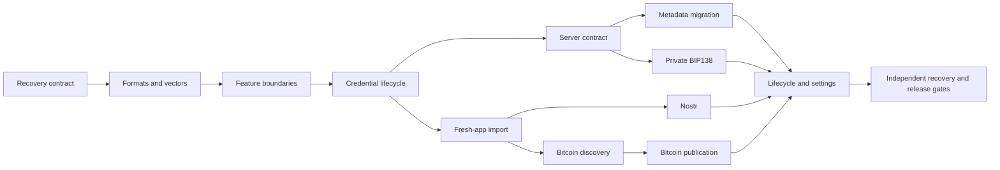

# Roadmap: private BIP138 backups and public password backups

Planning baseline: `distributed-resiliant-backups`, commit `7cf8694e6`, 2026-09-09. This document is a roadmap for review, not authorization to deploy or publish production data. It supersedes the destination/encryption assumptions in the earlier prototype plans while retaining their historical evidence. No application code changes are part of this planning task.

The end result is two independently recoverable types of data: complete supported wallet metadata, and the complete BullVault descriptor. Private descriptor storage uses BIP138; public descriptor copies use the BIP85-derived 12-word backup password and the existing RecoverBull encryptor. A fresh BULL installation must recover a vault without requiring the original mobile seed or restoring unrelated metadata.

## 1. What is decided

| Data and destination | Protection | Recovery inputs | Import scope |
| --- | --- | --- | --- |
| Standard metadata backup on the private backup server or in an exported file | RecoverBull encryption using the 12-word backup credential | Backup words; server access derived from the credential under the new protocol | Explicit preview and import of supported metadata |
| Private descriptor vault | BIP138 plus actual private access control | Authorized access or possession of a local file, then any eligible cosigner account xpub/key descriptor | Selected descriptor only |
| Public Nostr descriptor backup | RecoverBull encryption using the same 12 words | Backup words and an available relay | Selected descriptor only |
| Public Bitcoin descriptor backup | RecoverBull encryption using the same 12 words | Backup words and a compatible Electrum history server | Selected descriptor only |

These are two logical backup types, with different encrypted representations of the descriptor for different destinations. The public descriptor artifact must never contain private keys, full metadata, labels or unrelated wallet information. A metadata backup may continue to include vault information, but standalone descriptor recovery must not require downloading or importing metadata.

The 12 words remain a valid English BIP39 mnemonic deterministically derived through the existing reserved BIP85 path. They are displayed as a backup password for the user to record. They are not a request for a cold signer's mnemonic. The same password unlocks metadata and public descriptor files and derives the required public lookup and authentication keys. A descriptor-only screen limits what the app imports; it does not create a restricted sharing credential for somebody who knows that password.

Public destinations must reject BIP138/xpub-decryptable artifacts and metadata artifacts. There is no automatic fallback from the public password format to BIP138. Previously published ciphertext cannot be revoked by publishing a stronger replacement.

Bitcoin publication remains optional and explicitly authorized. One publication uses one transaction and one OP_RETURN carrying the full encrypted descriptor, not a hash, URL, template or remote pointer. Reuse existing transaction and Electrum components; no new mandatory indexer, mempool.space dependency or hardware-wallet feature.

## 2. Boundaries that need a decision before their implementation

**Meaning of private vault.** The working assumption here is a separate descriptor record on the authenticated metadata backup server. The existing RecoverBull seed-recovery vault and key-server product remain unchanged. If “private vault” instead means that seed-recovery product, its storage and recovery contract must be assessed before the private-vault phases below; do not silently change the seed-vault format.

**Private retrieval authorization.** An xpub decrypts a BIP138 file; knowledge of the xpub cannot also be treated as an independent authentication factor for a supposedly private download. Recommended first implementation: use a domain-separated server signing key derived from the 12-word backup credential for server access, then a cosigner xpub to decrypt. This is a proposed default to freeze before server implementation. This does not promise that an heir holding only a cosigner xpub can retrieve a private server record. Supporting such an heir through an independent access grant requires a separately specified recovery mechanism; do not assume every external signer can sign an arbitrary challenge.

**Password-only descriptor recovery from the server.** A private BIP138 file cannot be decrypted using only the new backup password. To retain the earlier goal of words-only, descriptor-only recovery from the server as well as Nostr/Bitcoin, the recommended server inventory is: metadata, private BIP138 descriptor, and a separately addressable password-encrypted descriptor copy. The last two are representations of the same logical vault backup, not additional wallet state. This additional server copy is a proposal for review. If it is excluded, the source picker must say that the private BIP138 route also requires a cosigner xpub; it must not secretly fetch full metadata to extract one.

**Publication and retention defaults.** Proposed defaults: explicit opt-in for Nostr; explicit fee approval for each Bitcoin publication; automatic retries only within the scope of the already approved operation; retain historical descriptor generations; retain legacy metadata recovery during migration. Choose the default relay set, private-record retention policy and eventual legacy-account deletion policy before release. No recurring spending permission is inferred from enabling backups.

**Credential lifecycle.** Initial production scope uses the existing reserved credential per originating mobile seed, covering its vaults. Seed replacement creates a new credential/identity namespace and requires an explicit migration flow. Do not introduce an undisclosed rotation index or extra recovery passphrase. Compromise of the parent mobile seed compromises its BIP85-derived backup password; deriving a child cannot repair weak parent RNG.

These decisions block the affected implementation chunks, not completion of this roadmap or independent protocol, recovery and test work.

## 3. Verified starting point

| Component | Present at the baseline | Remaining work |
| --- | --- | --- |
| Credential and encryption | [BackupPasswordMaterial](../lib/features/portable_backup/data/backup_password_material.dart), reserved BIP85 derivation and a thin [RecoverBull adapter](../lib/core/utils/recoverbull_encryption.dart) | Production secret lifecycle and public operation boundary |
| Portable artifact and Nostr prototype | [PortableBackupRepositoryImpl](../lib/features/portable_backup/data/portable_backup_repository_impl.dart), separate synthetic files and password-only relay recovery | Real vault sources, independent artifact APIs, history, source status, production import and routing |
| Metadata system | [WalletBackupFacade](../lib/features/wallet_backup/public/wallet_backup_facade.dart), canonical snapshots, serialized jobs, durable recovery fences, authenticated HTTP/CAS | New credential/auth identity, explicit format migration, additional server records |
| BIP138 | [Bip138Codec](../lib/features/bullvault/data/bip138_codec.dart) and descriptor parsing | Private repository and access-controlled server integration |
| Bitcoin prototype | [BitcoinBackupCodec](../lib/features/bullvault/data/bitcoin_backup_codec.dart), Electrum history/raw transaction retrieval, real BIP138 testnet4 evidence | Password-derived marker, public password framing, production funding and import |
| BullVault restoration | [RestoreBullVaultUsecase](../lib/features/bullvault/domain/usecases/restore_bullvault_usecase.dart), policy validation, rollback, signer matching and lineage handling | Fresh installation without original mobile seed; published descriptor-only restore contract |

The current portable `prepare` method requires both metadata and a descriptor. That coupling must be removed: metadata-only users must not need a BullVault, and a descriptor backup must not need a metadata export.

The metadata [key resolver](../lib/features/wallet_backup/domain/usecases/resolve_wallet_backup_key_usecase.dart) still uses the first 32 bytes of the reserved BIP85 entropy. Its [server protocol](../lib/features/wallet_backup/domain/wallet_backup_protocol.dart) uses a separate legacy Nostr identity and one fixed `wallet_backup` stream. Using the same RecoverBull cipher does not make the new key, wrapper or identity compatible with the old format.

The inspected mobile [HTTP repository](../lib/features/wallet_backup/data/metadata_backup_http_repository.dart) provides authenticated fetch/store/delete for that one stream. A nearby backend checkout, `/home/francis/bullnym-c30-contract-fixtures`, also documents one current metadata object per identity. This is source evidence, not proof of the deployed backend revision or support for descriptor records. Phase 0 identifies the authoritative server checkout and deployment contract.

Baseline validation is recorded in [portable-backup-security-review.md](portable-backup-security-review.md): 3,366 host tests, 11 final adapter tests, independent Python/Dart interoperability, and actual fresh-screen Nostr fetch/decryption on Android. The old Bitcoin profile has its own [testnet4 evidence](distributed-backups-testnet4.md). Neither proves the new Bitcoin password profile or production metadata restoration. No test suite is rerun merely to write this roadmap.

## 4. Proposed architecture

Follow `ARCHITECTURE.md`: UI → presentation → own use case → domain repository → data implementation/datasource. Facades expose published domain types, not wire models, native handles or raw secret material. New cross-feature calls go through the consumer's own use case. No business logic moves into `lib/core`, and no opportunistic package extraction is included.

| Owner | Responsibilities | Public boundary and dependencies |
| --- | --- | --- |
| `portable_backup` | Backup credential, portable encrypted artifacts, public Nostr and Bitcoin discovery/retrieval | Add a narrow facade and locator; no imports back to BullVault, WalletBackup or the RecoverBull app feature |
| `wallet_backup` | Metadata snapshots, server metadata records, compare/apply, durable writer state and migration | Reuse its facade and job runner; consume portable credential operations; continue consuming BullVault's published snapshot contribution |
| `bullvault` | Canonical descriptors, separately typed server descriptor records (BIP138 and the optional password copy), generation lifecycle, candidate preview, actual vault import and signer attachment | Consume the portable facade for public backup operations; retain BIP138 codec; add a purpose-specific private repository with a verified server contract |
| `backup_settings` and app onboarding | Metadata settings, backup password setup, source selection and recovery entry points | Consume published facades; compose navigation without passing raw mnemonic strings through routes |
| Existing RecoverBull app feature | Existing seed-vault and key-server workflows | Preserve behavior; using the RecoverBull encryption library does not migrate this product |
| Shared infrastructure | RecoverBull cipher calls, Nostr events/transport, Electrum connections, transaction parsing, screenshot protection | Reuse existing APIs; share only genuinely generic transport/signing serialization when needed |

Private and public descriptor artifact types must be distinguishable at the publication boundary. A generic `publish(bytes, destination)` API must not allow metadata or BIP138 to escape through a public writer. The private repository may share low-level HTTP plumbing; it must not import WalletBackup's internal repository or reuse the metadata record slot.

There is an existing, real `BullVault → RecoverBull → WalletBackup → BullVault` dependency cycle. Lazy DI does not remove it. Plan a separate scoped prerequisite commit that moves optional post-seed-recovery metadata orchestration to an app-composed completion callback/capability, removing RecoverBull's direct WalletBackup dependency while preserving its workflow. Update `FEATURES.md` in that commit. Do not expand this into an unrelated cleanup of the entire feature graph, and do not introduce a new `BullVault → WalletBackup` back-edge.

WalletBackup owns metadata persistence and its existing job runner. Its server-specific rate gate must not block unrelated Nostr or Bitcoin operations; reuse serialization only within the appropriate destination/owner scope. BullVault owns its publication receipts/generation state. PortableBackup owns cipher/transport operations rather than a second global synchronization engine. Register shared infrastructure and portable services before consumers; test startup, lazy resolution, recovery-only entry and disposal explicitly.

## 5. Protocol and storage rules to freeze

Preserve the implemented credential vector:

1. BIP85 entropy at `m/83696968'/1642'/0'/1'`, using all 64 derived bytes.
2. HKDF-SHA256, salt `bullbitcoin-backup-password`, info `mnemonic-v1`, 16 output bytes, encoded as 12 English BIP39 words.
3. Decode the words to their entropy; HKDF with the same salt and info `encryption-v1`, 32 output bytes, supplies the RecoverBull key.
4. Preserve the existing `nostr-auth-v1` scalar derivation from that key. Add explicitly domain-separated server-auth and Bitcoin-discovery contexts only through the frozen production profile, with cross-language vectors.

The exact prototype bytes are documented in [portable-backup-prototype.md](portable-backup-prototype.md). Production must have a distinct, frozen profile when adding fields or changing semantics. Do not silently reinterpret the existing prototype tag. Pin the supported BIP138 draft revision and vectors for private records; assess future draft changes through explicit compatibility work.

Public plaintext includes the complete canonical descriptor and only required recovery facts. Freeze format version, purpose and network; justify any additional vault/generation identifier or scan hint before including it. Lineage and generation annotations are advisory, even when authenticated. A descriptor must suffice to reconstruct scripts even when optional annotations are absent. Never invent an original revault schedule or signer ownership from missing metadata.

Retain gzip plus RecoverBull encryption, bounded before and after decompression, authenticated before parsing. Freeze binary header, lengths, version handling, maximum sizes and malformed-input behavior. Metadata and descriptor artifacts have separate authenticated purposes and fresh IVs. The proposed simplest public publication model seals one descriptor artifact per generation and reuses those bytes for retries and public destinations; identical ciphertext links the copies across transports, which must be an explicit privacy choice at the format gate.

Every server request signature and receipt binds the canonical resource identity and existing action/content-hash/revision semantics. That identity must unambiguously separate artifact purpose/profile and applicable descriptor generations/networks; do not duplicate those as extra fields when already bound, or force mixed-network metadata into a single-network record. A valid metadata signature must not authorize replacing a private descriptor record. A local installation can detect stale data relative to its saved checkpoint; a completely fresh installation cannot prove it has the latest backup solely from a server receipt or Nostr timestamp.

A public backup password holder can create apparently valid backup events. Backup authentication proves possession of the backup credential, not approval by the Bitcoin spending quorum. Validate descriptors, actual signer relationships and funded history; never automatically replace a vault's active receiving policy with the newest advertised candidate.

## 6. Ordered implementation chunks

The IDs below are reviewable delivery units. Split any unit that grows beyond one coherent change into its listed substeps, retaining the acceptance criteria. After the roadmap is approved, implementation progresses through the scheduled chunks and technical review gates without asking for renewed permission at each step. New material product decisions and production publication/funds authorization remain explicit user boundaries.

The server work and public recovery work can proceed independently once their shared credential/profile contract is frozen. An unresolved private-access choice blocks P4/P6, not the public transport track:

P0/P1 freeze the public contract independently of any still-open private-server details; the latter receive their own contract gate before P4. Implementation may advance an independent track while another awaits external backend work.

### P0 — Lock the recovery and server contract

- Confirm private-vault meaning, independent access authorization, server artifact inventory and the current backend/deployment revision.
- Write an input/output matrix for fresh recovery, existing-device recovery, server offline, missing metadata, and each eligible cosigner. Separate fetch authorization, decryption and spending authority.
- Inventory actual released formats/schema versions versus branch-only experiments. Identify whether any historical prototype artifacts contain real user data before deciding which legacy readers ship. List and fence prior public writers and their entry points before activating any new writer; inventory their now-unused Nostr signing scopes for later removal.
- Publish the proposed server record/auth/CAS contract and production profile choices for review; proposed endpoint/schema names are not existing capabilities.

**Exit:** every recovery route lists all required inputs and permissions; no route relies on a hidden xpub, original mobile seed, record ID or hypothetical hardware feature. Private authorization and optional server password-copy decisions are resolved before dependent server work.

### P1 — Freeze formats and independent vectors

**Areas:** portable password material/model, RecoverBull adapter, BIP138 codec, protocol documents, external recovery harness and fixtures.

- Preserve the current words and Nostr author vectors; specify new record identities and new server/Bitcoin contexts with independent implementations.
- Specify private/public artifact types, production discriminator, full-descriptor encoding, network binding and unsupported-version behavior. First test whether canonical descriptor plus network already supplies the required generation identity; add opaque IDs to the permanent on-chain payload only for a demonstrated recovery need.
- Produce independent encryption/decryption vectors, malformed files, maximum-size boundaries, and public/private routing rejection cases.
- Start the standalone recovery specification here, before publishing production ciphertext.

**Exit/tests:** two independent implementations agree on credential, author, marker and payload bytes where deterministic; randomized encryption interoperates. Wrong words, network, purpose, profile, MAC, padding and compressed expansion are rejected. The specification contains enough information to recover without BULL.

### P2 — Establish production boundaries without enabling writers

**Areas:** portable facade/locator, BullVault/WalletBackup consumers, RecoverBull completion wiring, app locator/router and `FEATURES.md`.

- First make the scoped dependency-cycle correction as its own atomic refactor, retaining seed-vault recovery behavior.
- Add the narrow portable operation facade; separate metadata creation from descriptor creation and opening.
- Keep root-xprv/word-returning synthetic fixture helpers outside the production public surface.
- Add distinct typed publication inputs and reject metadata/private BIP138 at both public transport boundaries.

**Exit/tests:** the RecoverBull → WalletBackup metadata-completion dependency is removed; remaining legacy cycles are documented, with no new back-edges or cross-feature internal imports; startup/DI/disposal and existing seed-vault completion tests pass; metadata works when no BullVault exists; descriptor creation requires no metadata snapshot. New remote writers remain disabled.

### P3 — Production backup-password lifecycle

**Areas:** portable credential owner, existing seed/BIP85 access, protected UI, Backup Settings and BullVault entry points.

- Regenerate the credential from the correct original mobile seed at point of use. Do not switch it because the user selected another wallet or network.
- Provide authenticated reveal, record-and-confirm flow, validation and re-entry. Keep words inside protected input/display and operation scope, not routes, Cubit state, logs, crash reports or persisted preferences.
- Distinguish backup words from mobile/cold spending seeds. Do not generate a spending wallet from this credential.
- Define seed replacement and migration behavior, unavailable seed, authentication cancellation, screen-protection failure, backgrounding and late worker results. Preserve an imported backup credential’s nonsecret identity across restart; require word re-entry when its secret is unavailable. Creating a new local wallet must never silently replace that recovery identity with the new seed’s BIP85 credential.

**Exit/tests:** fixed derivation remains unchanged across restart; cancellation before dispatch prevents publication; after transmission, report and reconcile an uncertain outcome because cancellation cannot recall an event or transaction; capture protection fails closed; validation/library exceptions cannot expose submitted words, including through logging/crash-report sinks; production consumers get capabilities/results rather than raw keys. Recording confirmation and actual remote success remain separate states.

### P4 — Server records and access control

**Areas:** authoritative backend, WalletBackup HTTP/auth protocol, BullVault descriptor-record repository, owning both the private BIP138 representation and optional password representation with distinct purposes. Reuse portable encryption/signing capabilities without a BullVault → WalletBackup dependency.

- Add the agreed separately fetchable record families and bounded listing of vault generations, with per-record CAS, quotas, retention and idempotent retry semantics.
- Bind record identity/purpose to authentication, content hashes and receipts. Maintain old endpoints/identities under explicit compatibility rules.
- Require authorization on every private read/list/export path; reject xpub-derived pseudo-authentication as an independent privacy barrier.
- Locate and follow the authoritative backend repository’s own AGENTS instructions, test commands and migration/deployment rules. Test the server implementation before connecting production mobile writers. Reuse existing signed-request, revision and error semantics where they fit; do not overwrite the existing metadata slot with a descriptor.

**Exit/tests:** real local/staging client-server contract tests pass for independent fetch/store/delete, unauthorized reads, cross-record substitution, stale CAS, request replay, lost acknowledgments, rate limits, quota failures and unavailable service. Source inspection alone is not this gate. Server operators receive ciphertext only, while record visibility/retention limits are documented.

### P5 — Metadata credential and format migration

**Areas:** metadata key resolver, encryption repository, authenticator, snapshot codec, state repository/job runner, file import/export, settings and recovery consumers.

- Add explicit old/new readers and a new identity/namespace; do not change the old resolver and hope existing records decrypt.
- Fetch and validate legacy data, establish the new credential and namespace, capture immutable snapshot bytes and their local revision under the existing job serialization, write the new encrypted snapshot, fetch/decrypt/compare it, then durably activate the new writer. Bind the receipt to those captured bytes/hash and revision. Edits made during upload stay dirty and schedule a follow-up; never advance the uploaded checkpoint to a newer unacknowledged local revision.
- Persist migration progress and keep recovery/apply fences across every crash boundary. An unreadable or unknown remote head is an error that blocks overwrite, never an empty backup.
- Keep the legacy reader and agreed recovery copy until the retention policy allows removal. Avoid two automatic writers making both namespaces appear current.
- Define concurrent old/new device behavior and downgrade behavior. Namespace separation prevents destructive overwrite, but does not merge edits from an old client; disclose divergence and require explicit reconciliation.

**Exit/tests:** existing supported metadata still restores; new words derive both lookup/authentication and decryption without the original seed for retrieval. Failures before or after any write, receipt, local activation or restart do not lose the recoverable copy or clear a required fence. Verify old fixtures, concurrent clients, unknown profiles and stale authentic snapshots. Exercise import of legacy exported metadata files through the new credential UI, not just server migration; provide the supported legacy credential path without silently interpreting old files as the new format. Fresh-device metadata application is completed through P7/P11, not claimed from decryption alone.

### P6 — Private BIP138 descriptor backups

**Areas:** BullVault descriptor source/parser/BIP138 codec, new private repository, server record contract and private recovery use cases.

- Create independent private records from canonical complete descriptors. Store each necessary generation without requiring the full metadata snapshot.
- Fetch only after authorized access, then decrypt with any of the three eligible cosigner account xpubs/key descriptors.
- Keep known-public/NUMS exclusions, network validation, exact account membership and format bounds. Explain excluded or unsupported inputs rather than silently promising universal recovery.
- If approved in P0, store the separate password-encrypted descriptor copy under its own purpose to support words-only descriptor retrieval from the server.

**Exit/tests:** all three cosigners independently decrypt the exact private descriptor after authorization; possession of an xpub alone does not download ciphertext. Private BIP138 and metadata cannot reach Nostr/Bitcoin writers. The optional password-only server route fetches the descriptor record without fetching metadata. Actual wallet import uses P7.

### P7 — Actual fresh-app descriptor recovery

**Areas:** BullVault restore use case/facade, signer ownership/descriptor ports, hardware wallet facade, app recovery route and existing wallet storage.

- Add a recovery entry before creation/import of the original mobile seed. Remove the current default-seed prerequisite for watch-only descriptor import.
- Validate and preview recovered candidates, then import the selected vault into normal app storage through BullVault's owner. Do not use the prototype's isolated SQLite wallet as production state.
- Support watch-only recovery first, with verified external signer attachment when available. Compare full keys/origins/network; a four-byte fingerprint alone is not ownership proof.
- Keep descriptor-only import separate from metadata apply. Restore wallet state needed for that vault, without importing unrelated labels, settings or wallets.
- Define wallet address discovery beyond the prototype’s fixed indices 0–199: resumable receive/change scanning with supported gap/scan hints, explicit progress and user-directed continuation. Reuse the real wallet sync owner, including its network/resource limits; an incomplete scan must not be displayed as a complete zero balance. The current prototype native sync has unbounded response-line allocation and inactivity-only timeouts: verify the production path and fix required bounds/cancellation before promoting it.
- Allow a separately reviewed local descriptor export when the payload authenticates and its descriptor syntax is supported but BULL cannot import that policy; never mark it restored or silently reinterpret it.
- Preserve multiple funded generations and deduplicate the same canonical descriptor across sources. Do not infer current vault, signer ownership or original scheduling metadata from timestamps alone. Advisory lineage/generation fields must not automatically hide or replace an active vault or establish predecessor/successor links; test these existing restore side effects explicitly.

**Exit/tests:** a fresh install opens an authenticated local password-encrypted fixture/file with the backup words and imports a watch-only vault without the original mobile seed; a locally supplied BIP138 file works with any eligible cosigner. P8/P10 add actual remote discovery and import, so this chunk does not depend on later transports. Restart retains the wallet, addresses and history. Matching signer attachment works; wrong signer fails without state corruption. Existing unrelated wallets, rollback, partial import, cancellation and repeat import are covered. Backup recovery does not claim to restore private spending keys.

### P8 — Production Nostr backup and retrieval

**Areas:** portable repository/facade, shared Nostr event/relay/session code, BullVault source capture and publication state.

- Feed real canonical descriptor generations into the password profile. Keep private BIP138 writers unreachable from production public publication.
- Derive lookup/signing from the backup words, verify author/signature/profile before decryption, and verify purpose/network/descriptor afterward.
- Add configured multiple relays with separate attempted, acknowledged, fetched-and-verified, failed and incomplete states. Introduce BullVault-owned durable exact signed-event bytes/ID and per-relay receipts here, before transmission; retries and restart reuse that event. Retrying one relay must not recreate unrelated work.
- Extend the current 32-event prototype limit into bounded history retrieval with overlapping queries, deduplication and explicit incompleteness, including timestamp ties and multiple vaults. A saturated same-timestamp boundary cannot be treated as exhausted history: NIP-01 supplies no general pagination cursor or completeness proof. Retain older valid generations; no latest-event-only restore. See [NIP-01 event/filter semantics](https://github.com/nostr-protocol/nips/blob/master/01.md).
- Respect existing proxy/privacy choices and disclose contact with relays. A successful acknowledgment is not a retention guarantee. Persist only the artifact/event identity and current per-destination outcomes needed for recovery/retry; an append-only attempt journal is not required. Delete superseded public BIP138 Nostr writers and their unused entry points once this chunk passes, preserving required legacy readers.

**Exit/tests:** production emulator publishes public test data, starts fresh, uses only words to fetch the exact new event and imports through P7 with the metadata server offline. Repeat with a failed relay, duplicate/older/malformed events, multiple generations and interrupted sessions. Metadata and private BIP138 publication attempts fail.

### P9 — Bitcoin password profile and Electrum discovery

**Areas:** portable Bitcoin framing/discovery, reusable parts of the old Bitcoin codec, Electrum datasource/connection and transaction parser.

- Derive one stable discovery script per backup credential and network. Proposed minimal design: a P2WPKH marker using a domain-separated scalar, with a frozen derivation and script convention. No three cosigner hints and no saved vault ID are needed; this one history locates that credential's vault generations.
- Put the complete binary encrypted descriptor artifact behind a compact versioned header in one OP_RETURN. Do not put base64, a URL, a hash-only reference or a separately required manifest on-chain.
- Query the marker script's transaction history, fetch candidate raw transactions, verify txid and marker membership, parse exact data-push boundaries, authenticate/decrypt, then validate the descriptor.
- Use history, not current UTXOs: spending the marker must not erase discoverability. Distinguish incoming backup transactions from transactions merely spending a marker.
- Bound responses, raw transactions, work and total operation time. Standard Electrum history has no general pagination parameter; process returned histories resumably and report known truncation, failures and resource limits honestly. A server may omit transactions without detection, so never claim proof of complete history. Permit retry with another configured compatible server. See [Electrum history methods](https://electrumx.readthedocs.io/en/latest/protocol-methods.html#blockchain-scripthash-get-history).
- Handle wrong genesis/network, mempool eviction, replacement transactions, reorgs, unavailable raw history and duplicate publications. Distinguish reported confirmation information from independently verified facts under the existing wallet's server-trust model.

**Exit/tests:** independently generated vectors recover with only words and a supported network/source; malformed/oversized/script-confused payloads and metadata/private profiles fail. Spent marker histories, multiple vaults, old funded generations, history limits and hostile server behavior are covered. No new dedicated discovery service or automatic xpub fallback.

### P10 — Minimal Bitcoin transaction and real testnet4 proof

**Areas:** existing transaction builder, fee estimation, coin selection, signing/broadcast capability, BullVault publication intent and durable receipts.

- Construct one OP_RETURN plus one required discovery output, with ordinary funding change only when necessary. Prefer the existing wallet's economical input selection; do not sacrifice fee economics or change ownership to win a fixed output count.
- Set the marker amount from the applicable transaction/relay requirements; do not retain the prototype's arbitrary three 1,000-sat hints or test-only vault payments.
- Keep normal change controlled by the funding wallet. Never send it to the password-derived marker merely to remove a change output: everyone receiving the backup password can derive that marker's spending key.
- Define marker ownership/coin-selection behavior and use a minimum deliberate amount. Do not implement automatic sweeping/CPFP as an extra feature unless the chosen publication flow requires it.
- Show the funding wallet, total fee and publication action clearly before approval, with exact payload bytes, weight/vbytes, marker value and change available in expandable details. Preserve explicit authorization across retry, transaction replacement and fee increases.
- Persist the exact signed raw transaction and txid before socket transmission, together with prepared/broadcast-pending/observed/confirmed/reorged state. After an uncertain broadcast outcome, reconcile the existing transaction before creating a second payment. P11 consumes this durable state; it does not introduce it later. Delete superseded public BIP138 Bitcoin writers once this chunk passes; retain independently reusable parsing and required legacy readers.

**Exit/tests:** unit/regtest tests prove one OP_RETURN, full ciphertext, one marker and only necessary change, correct fee arithmetic and no accidental funding to public-credential-controlled outputs. Fund a new testnet4 transaction using public synthetic fixtures, recover it through Electrum on a fresh emulator with server and Nostr disabled, match exact descriptor/addresses/history and import normally. Spend the marker in a separate test and repeat recovery of the original backup. Record txid, output inventory, serialized size, weight and fees; old BIP138 testnet4 evidence does not satisfy this gate.

### P11 — Lifecycle, settings and metadata recovery completion

**Areas:** BullVault create/activate/renew/reconcile flows, publication state, Backup Settings, onboarding and existing metadata compare/apply pipeline.

- Add BullVault backup settings with separate private, Nostr and Bitcoin statuses for each relevant generation. Show source, generation and verification date: success for generation N must not satisfy pending N+1. Metadata success must never mark descriptor destinations successful.
- Capture descriptor changes at the correct lifecycle transition; preserve recoverability of both old funded vaults and prepared successors. Resolve publication order relative to activation and payment broadcast explicitly in the lifecycle tests. Decide the visible “backup pending” state and any exception for receiving funds before all selected destinations succeed; do not silently change BullVault activation policy.
- Provide distinct actions to fetch privately with a cosigner, recover publicly with backup words, and recover all metadata with backup words. Avoid calling the public action “Fetch descriptor from xpub.”
- Complete fresh-device metadata preview/apply through the existing durable recovery fence. Respect source identity, existing wallets, missing spending seeds and partial restoration; password possession is not proof that the new local seed owns the recovered wallets. Preview supported network/proxy/automation settings before applying them; restored settings must not silently redirect the ongoing recovery session. Descriptor-only recovery has no settings side effects.
- Keep source failures independent. Offer retry without repeating successful publication; distinguish no results, wrong/invalid credential, authorization failure, unsupported version, incomplete history and unreachable service without claiming certainty the protocol cannot provide.
- Enabling public backup is deliberate; Bitcoin fees remain explicit. Deleting a local/private record or requesting relay deletion must not imply deletion from the blockchain or other people's copies.

**Exit/tests:** complete flows work on fresh and existing app installs, across restart, backgrounding, cancel/back, partial network success, multiple vaults, revaults with funds left behind, signer attachment and metadata conflicts. No full metadata writes occur during descriptor-only recovery. Localized copy/theme/UI-kit and accessibility exclusions are tested.

### P12 — Independent recovery, security, simplification and rollout

**Areas:** standalone recovery tool/specification, fixtures, production integration tests, obsolete prototype code/docs and release controls.

- Finish a local recovery tool that takes the recorded words, available relay/Electrum endpoint or supplied file/raw transaction, and produces the full descriptor without BULL storage, original seed, saved event ID or a proprietary service. Ship vectors, exact wordlist/derivations/profile and offline-readable instructions with it. Maintain one active recovery guide; archive superseded public BIP138 publication instructions with an explicit historical-only label.
- Exercise the intended inheritance journey with a fresh device, the recorded backup password and an authorized spending signer, with no original mobile seed or account/server dependency. A cosigner mnemonic alone is no longer sufficient to recover the public password-encrypted descriptor. Test actual spending through the recovered wallet’s inheritance branch on regtest; do not imply testnet4 can fast-forward a real future timelock.
- Conduct a deep security review of private access, weak-parent RNG, offline verifiers, backup credential sharing, parser bounds, secret lifetime, forged/stale candidates, signer ownership, metadata isolation, network privacy and funds movement.
- Run a simplification/deletion pass: verify removal of superseded public BIP138 writers, remove unused writer-only Nostr signing scopes and obsolete prototype coupling, isolate or remove demo entry points from shipping routes, and replace prototype-only restore storage with the real owner. Preserve necessary legacy readers and immutable public test evidence. Source cleanup must not delete dedicated funding wallets, test funds, signing material or Docker volumes. Do not reintroduce a cipher implementation or a transport plugin framework.
- Fix findings, rerun affected checks and the mandatory review gate, then repeat actual fresh-emulator Nostr and Bitcoin recovery after the final fixes. Rebuild/install the normal application entry point after integration tests.
- Roll out in stages: developer/regtest → public synthetic testnet4 → controlled beta → production only after the private server, migration and recovery gates pass. Keep new writers disabled for unsupported server/profile states. Rollback stops new publication and preserves readers/data; it cannot undo public disclosure or already broadcast transactions.

**Exit:** independent recovery succeeds; all required host/backend/device checks pass on the final source; seven review lenses have no unresolved fix-now findings; testnet4/Nostr evidence identifies the exact commit and publications; production release defaults and migration/retention decisions are explicit.

## 7. Required acceptance matrix

| Scenario | Required outcome |
| --- | --- |
| Backup words; original mobile seed absent | Discover/decrypt public descriptor and import watch-only; never claim private keys restored |
| Authorized private fetch plus each cosigner xpub | Each eligible key independently opens the same full BIP138 descriptor |
| Xpub without private access authorization | No private ciphertext download; no public password-backup decryption |
| Descriptor-only request | Does not need metadata bytes and does not apply unrelated metadata |
| Metadata backup for a user without BullVault | Works independently; no descriptor prerequisite |
| Server offline | Nostr or Bitcoin recovery remains available if that source retains the backup |
| Nostr unavailable | Bitcoin history recovery works through Electrum |
| Spent discovery output | Original Bitcoin backup remains discoverable through history |
| Multiple vaults/revaults, including funded older vaults | Retain and identify all recoverable candidates; never discard solely by timestamp |
| Wrong network/profile, corrupted or oversized data | Reject safely before local wallet mutation |
| Crash during migration/import/broadcast | Durable fences/status prevent destructive overwrite, false success or accidental duplicate spending |
| Old app and new app both active | Defined namespace/compatibility behavior; no silent merge or overwrite of an unreadable head |
| Backup credential holder publishes an altered descriptor | No automatic adoption as the active spending/receiving policy; validate and preview |
| Weak independent cosigner seed | Public password artifact provides no cosigner-xpub decryption route; private-copy leakage remains a documented risk |
| Weak parent mobile seed | Explicitly outside any claimed BIP85 protection; test derivation dependency and avoid misleading security copy |
| Recovery years later with original services gone | Documented independent decoding and standard-history discovery work against available compatible sources; no availability guarantee |

## 8. Review and verification gate for every code chunk

1. Implement only the next agreed chunk, including required tests and documentation.
2. Run the targeted tests appropriate to its risk. Run `make build-runner`, `make translations` and `make drift-migrations` only when their inputs change. Add/update/remove localization keys through `tools/arb.dart` before generation. Preserve all immutable published schema versions as supported upgrade sources; combine unreleased changes into the single pending revision and verify the latest published schema to final-pending path plus affected older migration chains. Inspect generated diffs: broad targets also affect packages such as bull_payjoin and must not introduce unrelated schema/code churn.
3. Run `make deps`, whole-project `make analyze`, `make fix-check`, `make format-check`, `make bull-ui-check` and `make unit-test` as required by the repository; `make checks` provides the consolidated gate. `fvm dart fix --dry-run` must report `Nothing to fix!`. Never bypass commit hooks. The existing `bull-ui-check` is limited to the coins UI; explicitly review new backup screens for localization, theme tokens, shared widgets and secret accessibility protection rather than treating that check as coverage of them.
4. Run seven reviewers: architecture, evidence/AI slop, Dart correctness, UX, simplification, deletion/scope and AGENTS compliance. Cross-review the combined findings, reconcile evidence and classify fix-now versus explicitly safe deferral.
5. Fix all fix-now issues. Material fixes receive another seven-reviewer pass and affected tests; continue only when the chunk's checks and review gate pass.
6. At the public-transport milestones and after final security/simplification changes, run real Android Nostr and testnet4 recovery. Do not substitute local round trips, screenshots or an old event/transaction for the specified fresh-publication proof.

Keep each coherent implementation/refactor in an atomic Conventional Commit. PR descriptions must identify security-sensitive encryption, authentication, backup/recovery and funds changes and their validation. Use FVM/make tooling throughout. Host native tests and Android builds run separately because this branch has a documented native-asset collision when run concurrently. Use only public synthetic credentials and test funds for public evidence. Planning and review agents run in waves under the available concurrency limit; a capacity limit does not remove any of the seven lenses.

## 9. Scope limits and long-term recovery documentation

This plan does not change BullVault's spending policy, redesign the RecoverBull seed-vault product, add new cryptographic primitives, require private-key export from hardware, publish full metadata, invent a new blockchain indexer or perform a general monorepo migration. Optional mempool.space retrieval, automated fee sponsorship/sweeping, threshold backup passwords, arbitrary rotation indices and read-only sharing credentials are not prerequisites for this delivery.

The recovery guide must list the two necessary capabilities explicitly: the 12-word backup password recovers the descriptor; spending requires an authorized signer (or its recovery material) and satisfied script conditions. Record the backup password alongside the inheritance instructions; the heir’s cosigner mnemonic alone cannot derive this password from a different originating mobile seed. A source endpoint/network is public configuration, not an additional secret; nevertheless words cannot locate an arbitrary forgotten custom server or guarantee a dead relay's retention. Document default profiles, known network identifiers, alternate-source setup and how to decode a supplied ciphertext or raw Bitcoin transaction entirely offline.

Private BIP138 reduces public exposure through access control, not through immunity to weak seeds if its ciphertext is leaked. Public password encryption protects against cosigner-xpub disclosure, not compromise of the parent mobile seed. The chosen single marker and stable Nostr author link generations; ordinary funding inputs/change may link a Bitcoin backup publication to other wallet activity. Make these limits explicit without presenting speculative future cipher failure as inevitable.

External protocol references checked during planning on 2026-09-09: [Electrum history and transaction methods](https://electrumx.readthedocs.io/en/latest/protocol-methods.html#blockchain-scripthash-get-history) and [Nostr NIP-01 event/filter semantics](https://github.com/nostr-protocol/nips/blob/master/01.md). Production wire choices are BULL profile decisions, not claims of a registered Nostr standard or future BIP138 compatibility.

## 10. Planning status

- [x] Ground the roadmap in the current branch, existing APIs and prototype evidence.
- [x] Record confirmed destination/encryption and recovery decisions.
- [x] Separate protocol, backend, migration, actual import, public transport and lifecycle work into acceptance-gated chunks.
- [x] Complete all seven planning contributions and cross-agent debate; reconcile the final roadmap.
- [ ] Resolve private-vault meaning, authorization and optional password-only server descriptor copy before dependent implementation.
- [ ] Review the roadmap with the user before starting application or backend implementation.
