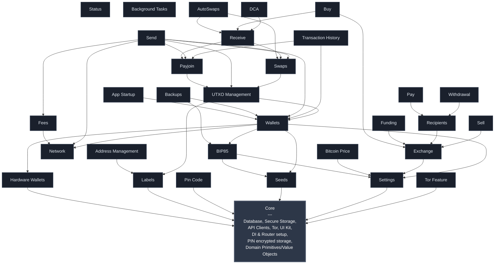

# Feature Dependencies

This diagram shows the dependencies between features in the Bull Bitcoin Mobile application. It helps visualize the dependency graph and ensures there are no cyclic dependencies.

**Diagram Type**: This is a **Package Dependency Diagram** (also known as Module Dependency Graph or Component Dependency Diagram in UML).

## Module Dependency Graph

## About Package Dependency Diagrams

### What This Diagram Shows

- **Modules/Packages**: Each box represents a self-contained feature/package
- **Dependencies**: Arrows show "depends on" relationships (A → B means "A depends on B")
- **Direction**: Dependencies flow from dependent to dependency (not data flow)

### Standard Information in Package Diagrams

1. **Module Names**: Clear identification of each package/feature
2. **Dependency Direction**: Arrows indicating which module depends on which
3. **Optional Elements** (can be added):
   - Dependency type labels (e.g., "uses facade", "imports types")
   - Stereotypes like `<<core>>`, `<<feature>>`, `<<infrastructure>>`
   - Access modifiers (public/internal APIs)
   - Dependency cardinality (required vs optional)

## Dependency Rules

1. **No Cyclic Dependencies**: Features must not create circular dependency chains
2. **Core Independence**: Core must not depend on any feature
3. **Feature Isolation**: Features should communicate through well-defined facades/interfaces
4. **Layered Dependencies**: Dependencies should generally flow in one direction

## Core Dependencies

**Important**: All features implicitly depend on Core for foundational services. These dependencies are not shown in the diagram to reduce visual clutter.

### What Core Provides

1. **Infrastructure Services**:
   - Database (Drift/SQLite)
   - Secure Storage instance (Flutter Secure Storage)
   - API Clients (REST/GraphQL clients)
   - Tor client instance
   - UI Kit (shared widgets, theme)
   - DI setup and interfaces (Service Locator pattern)
   - Router setup and interfaces (Navigation)
   - PIN encrypted storage

2. **Domain Primitives** (also called Value Objects or Shared Kernel):
   - Located in `/lib/core/primitives/`
   - Examples: `SeedSecret`, `SeedUsagePurpose`, `Fingerprint`, `Address`, `Amount`, etc.
   - Shared domain types used across multiple features
   - Immutable, validated value objects that ensure domain integrity

## Key Dependency Patterns

### Central Features (Highly Depended Upon)
- **Core**: Foundation for all features
- **Wallets**: Used by Send, UTXO Management, Transaction History, Backups, App Startup
- **Seeds**: Used by Wallets, BIP85, Hardware Wallets
- **Settings**: Used by Wallets, Exchange, BIP85, Bitcoin Price
- **Recipients**: Used by Pay, Withdrawal
- **UTXO Management**: Used by Send, Swaps, Payjoin

### Leaf Features (Depend on Many, Few Depend on Them)
- **Send**: Depends on Fees, Network, Payjoin, Swaps, UTXO Management, Wallets
- **Receive**: Depends on Payjoin, Swaps
- **AutoSwaps**: Depends on Receive, Swaps
- **Backups**: Depends on BIP85, Wallets

### Exchange-Related Features
- **Buy, Sell, Funding**: All depend on Exchange
- **Recipients**: Depends on Exchange

## Verification

To verify no cyclic dependencies exist, you can:

1. **Manual trace**: Follow any path through the graph - it should never return to a previously visited node
2. **Automated tools**: Use `dart pub deps` or custom dependency analysis scripts
3. **Import analysis**: Review import statements in facade/public API files

## Future Improvements

- Add dependency type labels (e.g., "uses facade", "imports primitives")
- Document which specific APIs each feature exposes
- Add dependency cardinality (required vs optional dependencies)
- Include compile-time vs runtime dependency distinction
- Add layer groupings (presentation, application, domain, infrastructure)
