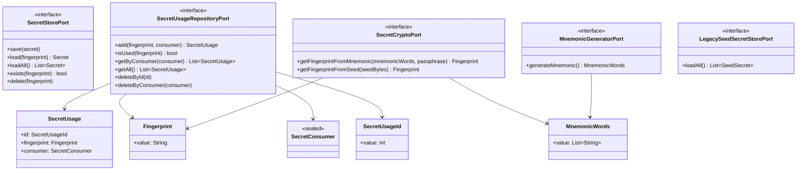

# Secrets Feature Architecture

This document describes the architecture of the Secrets feature, which manages cryptographic secret storage, usage tracking, and provides a public API for other features.

## Architecture Overview

The Secrets feature follows Clean Architecture principles with clear separation of concerns across distinct layers:

**Note**: Presentation Layer (BLoC) and Public Facade are both at the same architectural level - they are controllers for different triggers:

- **Presentation Layer**: Handles UI events and state
- **Public Facade**: Handles external calls from other features

Both depend on the Application Layer use cases but serve different clients.

## Architecture Diagrams

### Overview - Simplified Component Diagram

This diagram shows the main components and how they interact across layers:

### Domain & Core Layer

Foundation types and business entities:

### Application Layer - Ports (Interfaces)

Contracts that define dependencies on external systems:

### Application Layer - Use Cases

Orchestration and business logic operations. Each use case coordinates multiple ports to fulfill a specific application need:

### Interface Adapters Layer

Implementations of ports using external frameworks and services:

### Controllers - Public Facade & Presentation

Entry points for external features and UI:

## Layer Responsibilities

### Domain Layer

- **Entities**: Core business domain objects with rules (`Secret`, `SeedSecret`, `MnemonicSecret`, `SecretUsage`)
  - Located in `/lib/features/secrets/domain/entities/`
- **Value Objects**: Immutable types with validation (`Fingerprint`, `SecretUsageId`, `SecretConsumer`, `MnemonicWords`, `Passphrase`, `SeedBytes`)
  - Located in `/lib/features/secrets/domain/value_objects/`
  - Enforce domain constraints (e.g., fingerprint must be 8 hex chars, mnemonic must be 12/15/18/21/24 words)
- **Domain Errors**: Domain-specific exceptions (`InvalidFingerprintFormatError`, `InvalidMnemonicWordCountError`, etc.)

### Application Layer

- **Use Cases**: Orchestration and business rule enforcement (10 use cases)
  - Coordinate multiple ports to fulfill application requirements
  - Enforce business rules (e.g., "cannot delete secret if in use")
  - Implement application workflows (e.g., create → store → register usage as atomic operation)
  - Registration now happens within import/create use cases (no separate RegisterSecretUsageUseCase)
- **Ports**: Interfaces defining boundaries with external systems

### Interface Adapters Layer

- **Repositories**: Data access implementations (`DriftSecretUsageRepository`)
- **Stores**: Secure storage adapters (`SecretStore`)
- **External Service Adapters**: Crypto and mnemonic generation (`BdkMnemonicGenerator`, `Bip32And39SecretCrypto`)

### Public Facade Layer

- **SecretsFacade**: Unified API for other features to interact with secrets
- Handles calls from external features
- Converts application errors to facade-level errors

### Presentation Layer

- **BLoC**: State management for UI (`SecretsViewBloc`)
- **View Models**: UI-specific data structures (`SecretViewModel`)
- Handles UI events and state updates

## Key Data Flows

### Creating a New Secret

### Deleting a Secret

### Importing a Mnemonic Secret

### Importing a Seed Secret (bytes)

### Getting a Secret

### Getting Secret Usages by Consumer

### Deregistering All Usages of a Consumer

### Loading All Stored Secrets

### Loading Legacy Secrets

### Listing Used Secrets

## Design Patterns

- **Clean Architecture**: Layered architecture with dependency inversion
- **Use Case Pattern**: Each business operation encapsulated in a dedicated class
- **Repository Pattern**: Data access abstraction
- **Port/Adapter Pattern**: External dependencies hidden behind interfaces
- **Facade Pattern**: Simplified public API for complex subsystem
- **Command/Query Segregation**: Clear separation between operations that modify state vs read state
- **BLoC Pattern**: Transform data between Application and Presentation layers
- **Domain Boundary Protection**: Entities and Value Objects cannot be constructed outside domain/application layers (see Business Rules)
- **Error Boundary Pattern**: Each layer catches and transforms errors from lower layers, preventing error leakage (see Error Handling Strategy)

## Key Business Rules

1. **Secret Deletion Protection**: A secret cannot be deleted if it has registered usages
2. **Atomic Registration**: Secret creation/import and usage registration happen atomically within the same use case
3. **Fingerprint Identity**: Secrets are uniquely identified by their BIP32 fingerprint (4 bytes, 8 hex chars)
4. **Value Object Validation**: Domain constraints are enforced at creation time:
   - Fingerprint: Must be exactly 8 hexadecimal characters
   - MnemonicWords: Must be 12, 15, 18, 21, or 24 words
   - Passphrase: Maximum 256 characters
   - SeedBytes: Must be 16, 32, or 64 bytes (128, 256, or 512 bits)
5. **Consumer-Based Tracking**: Usages are tracked by consumer (WalletConsumer, Bip85Consumer) rather than generic purpose/reference strings
6. **Legacy Support**: Old secrets can be loaded and migrated through dedicated use case
7. **Secure Storage**: Secrets are stored separately from usage metadata (secrets in secure storage, usages in SQLite)
8. **Domain Boundary Protection**: Business rules are enforced exclusively within the domain and application layers:
   - **Input Constraint**: Use case commands/queries, facade methods, and BLoC events accept only primitive types (String, int, List\<String\>, etc.), never Entities or Value Objects
   - **Output Freedom**: Use cases, facade methods, and BLoC state can return Entities and Value Objects
   - **Validation Location**: All domain validation happens when Value Objects are constructed within use cases
   - **Prevents Business Rule Bypass**: External callers cannot construct invalid domain objects or bypass validation rules

## Error Handling Strategy

The Secrets feature implements a strict error boundary pattern where each layer catches and transforms errors from lower layers. This prevents error leakage and ensures each layer uses its own error vocabulary appropriate for its consumers.

### Error Layer Hierarchy

### Layer-by-Layer Error Handling

#### 1. Domain Layer (`SecretsDomainError`)

**Purpose**: Enforce domain invariants and validation rules

**When Thrown**: When Value Objects are constructed with invalid data

---

#### 2. Application Layer (`SecretsApplicationError`)

**Purpose**: Distinguish user input errors from infrastructure failures, use application-specific vocabulary

**Key Principle**: Use cases NEVER let domain errors escape. They catch all `SecretsDomainError` exceptions and transform them to `SecretsApplicationError`.

---

#### 3. Facade Layer (`SecretsFacadeError`)

**Purpose**: Provide clean error API for external features, hide internal implementation details

**Key Principle**: Facade NEVER lets application errors escape. All `SecretsApplicationError` exceptions are caught and transformed to `SecretsFacadeError`.

---

#### 4. Presentation Layer (`SecretsPresentationError`)

**Purpose**: Provide user-friendly error messages for UI display

**Key Principle**: Presentation NEVER lets application errors escape. All `SecretsApplicationError` exceptions are caught and transformed to `SecretsPresentationError` with user-friendly messages.

---

### Error Flow Example

**Scenario**: User imports a mnemonic with 11 words (invalid)

### Benefits of This Strategy

1. **Error Isolation**: Errors are contained within layer boundaries and never leak upward
2. **Appropriate Vocabulary**: Each layer uses terminology appropriate for its consumers
3. **User Experience**: End users see friendly, actionable messages
4. **Developer Experience**: External features get clear, documented error types
5. **Debugging**: Error chain preserved via `cause` field for troubleshooting
6. **Flexibility**: Layers can group, split, or transform errors differently based on their needs
7. **Type Safety**: Exhaustive pattern matching ensures all error cases are handled
