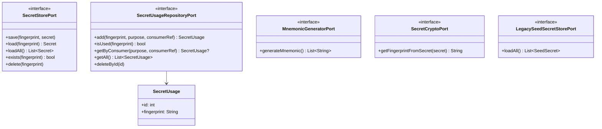

# Secrets Feature Architecture

This document describes the architecture of the Secrets feature, which manages cryptographic secret storage, usage tracking, and provides a public API for other features.

## Architecture Overview

The Secrets feature follows Clean Architecture principles with clear separation of concerns across distinct layers:

**Note**: Presentation Layer (BLoC) and Public Facade are both at the same architectural level - they are controllers for different triggers:

- **Presentation Layer**: Handles UI events and state
- **Public Facade**: Handles external calls from other features

Both depend on the Application Layer use cases but serve different clients.

## Architecture Diagrams

### Overview - Simplified Component Diagram

This diagram shows the main components and how they interact across layers:

### Domain & Core Layer

Foundation types and business entities:

### Application Layer - Ports (Interfaces)

Contracts that define dependencies on external systems:

### Application Layer - Use Cases

Orchestration and business logic operations. Each use case coordinates multiple ports to fulfill a specific application need:

### Interface Adapters Layer

Implementations of ports using external frameworks and services:

### Controllers - Public Facade & Presentation

Entry points for external features and UI:

## Layer Responsibilities

### Domain Layer

- **Entities**: Core business domain objects with rules (`SecretUsage`)
- **Value Objects**: Primitive types from `/lib/core/primitives/secrets/` (`Secret`, `SeedSecret`, `MnemonicSecret`, `SecretUsagePurpose`)

### Application Layer

- **Use Cases**: Orchestration and business rule enforcement (12 use cases)
  - Coordinate multiple ports to fulfill application requirements
  - Enforce business rules (e.g., "cannot delete secret if in use")
  - Implement application workflows (e.g., create → store → register usage)
  - **Composed Use Cases**: Higher-level use cases that combine multiple atomic use cases to handle complex scenarios while avoiding code duplication (e.g., `DeregisterSecretUsageWithFingerprintCheckUseCase` combines get-usage and deregister-usage with fingerprint validation)
- **Ports**: Interfaces defining boundaries with external systems

### Interface Adapters Layer

- **Repositories**: Data access implementations (`DriftSecretUsageRepository`)
- **Stores**: Secure storage adapters (`SecretStore`)
- **External Service Adapters**: Crypto and mnemonic generation (`BdkMnemonicGenerator`, `Bip32And39SecretCrypto`)

### Public Facade Layer

- **SecretsFacade**: Unified API for other features to interact with secrets
- Handles calls from external features
- Converts application errors to facade-level errors

### Presentation Layer

- **BLoC**: State management for UI (`SecretsViewBloc`)
- **View Models**: UI-specific data structures (`SecretViewModel`)
- Handles UI events and state updates

## Key Data Flows

### Creating a New Secret

### Deleting a Secret

### Importing a Mnemonic Secret

### Importing a Seed Secret (bytes)

### Getting a Secret

### Deregistering Secret Usage with Fingerprint Check

### Loading All Stored Secrets

### Loading Legacy Secrets

### Listing Used Secrets

## Design Patterns

- **Clean Architecture**: Layered architecture with dependency inversion
- **Use Case Pattern**: Each business operation encapsulated in a dedicated class
- **Repository Pattern**: Data access abstraction
- **Port/Adapter Pattern**: External dependencies hidden behind interfaces
- **Facade Pattern**: Simplified public API for complex subsystem
- **Command/Query Segregation**: Clear separation between operations that modify state vs read state
- **BLoC Pattern**: Business logic separation in presentation layer

## Key Business Rules

1. **Secret Deletion Protection**: A secret cannot be deleted if it has registered usages
2. **Usage Tracking**: All secret access must be registered with a purpose and consumer reference
3. **Fingerprint Identity**: Secrets are uniquely identified by their BIP32 fingerprint
4. **Legacy Support**: Old secrets can be loaded and migrated through dedicated use case
5. **Secure Storage**: Secrets are stored separately from usage metadata (secrets in secure storage, usages in SQLite)
